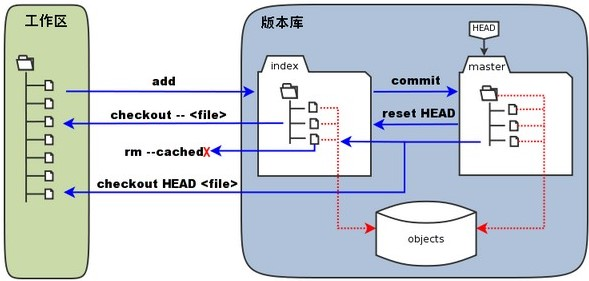

## 简介

**Git**是[一个分布式版本控制系统](https://www.liaoxuefeng.com/wiki/896043488029600)。

**CVS**、**SVN**是集中式版本控制系统，且跟踪的是文件；[与之相比](https://www.cnblogs.com/dazhidacheng/p/7478438.html)，**Git**提供了丰富的库、版本管理，且跟踪的是文件中的修改（粒度更细），只是没有子路径的权限控制（Gitosis）。

这里的分布式是指，每个编辑者在本地都有一个完整的版本库，各个编辑者通过交换改动内容来同步文档，当然编辑者之间往往不是直接交换，也是通过一台中央服务器来协助同步工作。

## 目录结构

如[上图](https://www.runoob.com/git/git-workspace-index-repo.html)所示，**Git**包括包含两类目录：

1. **Work Directory**：**工作区**是我们用`git init`指定的目录。
2. **Repository**：该目录下的隐藏文件夹`.git`就是**Git**的本地版本库。
   1. **Stage**/**Index**：**暂存区**是库中最重要部分，实际上是一个文件，名为`.git/index`。
   2. **Master**：主分支是该库的第一个分支，指向分支，是由**Git**自动创建的。
   3. **Head**：指向**Master**的指针，由**Git**自动创建。
   4. **Objects**：保存着实际的对象及内容，而**Stage**、**Master**以目录树的形式索引这些对象和内容。

### 暂存区

**Stage**存在的意义是，将我们在**工作区**正在进行的改动保存起来，然后**工作区**空了，我们就可以进行其它紧要任务，待紧要任务完成后，再从**Stage**恢复任务到**工作区**，继续先前的工作。

**Stage**可以保存多个**Branch**。

git add命令是将**工作区**中的文件添加到**Stage**，git commit命令是将**Stage**的文件提交到当前**Branch**。

- git add实际上是将**工作区**的修改的内容写入到**Objects**中的一个新对象，并将新对象的ID记录到**Stage**（更新目录树）。
- git commit实际上是将**Stage**更新到对应**Branch**（目录树）。

### 忽略

对于不想提交的文件，我们可以列在`.gitignore`文件中，以下是需要忽略的几类文件：

1. **OS**自动生成的某些文件，如略缩图。
2. 编译生成的中间文件，如`*.class`文件。
3. 包含敏感内容的文件，如口令等。

## 命令

| 命令                                                         | 描述                                                         |
| ------------------------------------------------------------ | ------------------------------------------------------------ |
| **初始化**                                                   |                                                              |
| git config --global user.name "Your Name" git config --global user.email "Your Email" | 设置用户信息                                               |
| git config --global color.ui true | 开启颜色，使命令更醒目                                     |
| git init               | 在相应目录上运行该命令能够将该目录变为一个**Git**仓库。同时会生成一个隐藏目录`.git` |
| git init \<repository> | 将指定目录作为**Git**仓库                                  |
| git add \<file>        | 新增文件到本地仓库                                         |
| git commit -m \<annotation> | 提交改动到本地仓库                                         |
| git rm \<file>         | 删除文件，删除后还需要提交到仓库                           |
| git mv \<file>         | 移动/重命名文件                                            |
| **版本跳转**                                                 |                                                              |
| git status             | 该命令用来查看仓库的状态，如，哪些文件修改了，哪些修改没有提交等 |
| git diff \<file>       | 查看文件的变动内容                                         |
| git log                | 查看提交历史                                               |
| git relog              | 查看命令历史                                               |
| git reset --hard HEAD^ | 回退版本                                                   |
| **暂存区与工作区**                                           |                                                              |
| git restore --worktree \<file> | 从**Stage**恢复到**工作区**                                |
| git restore --staged \<file> | 从**Master**恢复到**Stage**                                |
| git restore --source=HEAD --staged --worktree \<file> | 从**Master**恢复到**Stage**以及**工作区**                  |
| git checkout -- \<file> | 将**工作区**的修改撤销                                     |
| git stash              | 将**工作区**保存到**Stage**                                |
| git stash list         | 列出**Stage**保存的内容                                    |
| git stash pop          | 将**Stage**的栈顶内容恢复到**工作区**（恢复后会在**Stage**中删除该内容） |
| git stash apply        | 从**Stage**恢复内容到**工作区**（不删除）                  |
| git stash drop         | 清空**Stage**？                                              |
| git cherry-pick \<commit> | 复制特定提交到当前**Branch**，减少重复劳动                 |
| git rebase             | 整理**Branch**，合并成一条直线                             |
| **分支**                                                     |                                                              |
| git branch             | 不带参数的话，是列出所有**Branch**                         |
| git branch  \<branch>  | 创建**Branch**                                             |
| git checkout \<branch> git switch \<branch> | 切换**Branch**                                             |
| git checkout -b \<branch> git switch -c \<branch> | 创建并切换到另一个**Branch**                               |
| git merge \<branch>    | 合并指定**Branch**到当前**Branch**，默认按快速合并模式（`fast-forward`）执行，即，直接将**Master**指向**Branch**的当前提交，当我们删除**Branch**时，**Branch**历史也会被删除，可通过添加`--no-ff`来关闭快速合并（新增一个提交），保留**Branch**历史 |
| git log -graph         | 查看**Branch**合并情况                                     |
| git branch -d \<branch> | 删除**Branch**                                             |
| git branch -D \<branch> | 强行删除**Branch**，常用于删除未合并的**Branch**           |

可以参照[该表格](https://liaoxuefeng.gitee.io/resource.liaoxuefeng.com/git/git-cheat-sheet.pdf)中的命令。

> **Git**允许我们为命令起别名，以减少重复劳动。

### 常用命令

如上图所示，**Git**最常用的命令有6个：git clone、git checkout、git pull、git push、git add、git commit。

### 修复缺陷

1. 我们往往会针对某一缺陷新建专门的**Branch**来修复，然后合并分支，最后删除该分支。
2. 当手头工作没有完成时，可执行git stash先将这些改动保存到**Stash**，待缺陷修复后，再使用git stash pop还原。
3. **Master**上的改动，可执行git cherry-pick \<commit>将提交复制到当前**Branch**，减少重复劳动。

