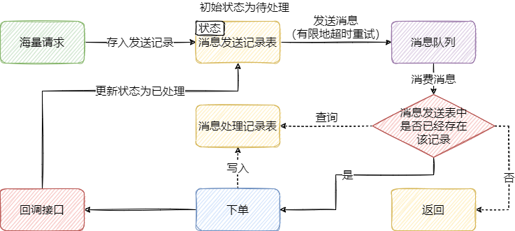

## 前端

秒杀的最大特点是“瞬时高并发”，这需要我们[从前后端同时处理](https://www.zhihu.com/question/20978066/answer/2027433026)。

比起后端，活动页面是流量最大的地方，前端处理措施是<span style=background:#c9ccff>减少</span><span style=background:#f8d2ff>请求</span>：

1. <span style=background:#c2e2ff>页面静态化</span>
   1. 从而<span style=background:#c9ccff>减少</span>了动态<span style=background:#f8d2ff>请求</span>，也<span style=background:#c9ccff>减少</span>总体<span style=background:#f8d2ff>请求</span>次数。
   2. 再配合<u>CDN</u>（Content Delivery Network）加速，提升响应速度。
2. <span style=background:#c2e2ff>秒杀按钮</span>
   1. 活动不开始，则按钮不可用，这又<span style=background:#c9ccff>减少</span>一部分<span style=background:#f8d2ff>请求</span>。
   2. 可通过“Javascript设置按钮+CDN缓存 / 不缓存该js文件”的方式实现。


## 缓存

秒杀的另一个特点是<span style=background:#ffb8b8>读多写少</span>，而且商品的库存其实是极其有限的，这都暗示了秒杀的本质是<span style=background:#ffb8b8>抽奖</span>，即，只有额定数量的用户能进行写操作，[开发者只需要确保有足够的算力把大多数请求挡回去就够了](https://www.zhihu.com/question/20978066/answer/1478490284)，比如将`5000K`的并发削为`5K`。

显然，RDBMS是无法应对这种场景的，需要使用<span style=background:#c2e2ff>缓存中间件</span>（**Redis**）。

**Redis**往往需要部署<span style=background:#c2e2ff>多台</span>（集群），可能需要设置**主从同步**、**读写分离**，进而需要考虑<span style=background:#19d02a>分布式锁</span>。

### 缓存问题

**Redis**中需要保存商品大部分信息：编码、名称、规格属性、<span style=background:#c2e2ff>库存</span>，用户在下单时需要对这些信息进行<span style=background:#c2e2ff>验证</span>。这些商品信息需要<span style=background:#c2e2ff>提前</span>放入**Redis**中，不然会引发<span style=background:#d4fe7f>缓存击穿</span>。

不存在的商品在首次请求后也可以保存到**Redis**中，以减少<span style=background:#d4fe7f>缓存穿透</span>的发生。

### 库存

<span style=background:#c2e2ff>库存</span>是商品的核心属性：用户成功下单时，要<span style=background:#d4fe7f>预扣库存</span>；用户支付超时后，要<span style=background:#d4fe7f>回退库存</span>。

<span style=background:#d4fe7f>预扣库存</span>时，需要考虑避免<span style=background:#d4fe7f>超卖</span>：

1. 低并发下可直接使用代码锁（`synchronized`）或数据库的乐观锁直接搞定：

   ```sql
   update product_info set stock=stock-1 where id=product_id and stock > 0;
   ```

2. 高并发下可使用**Redis**+**Lua**的方式：

   1. 程序设计：
      
      ```java
      // 先判断用户是否已经成功下单（每人限购n件），否，则返回；
      // 是，则再判断库存是否充足，否，则返回；
      // 是，则减库存，然后判断减完的库存是否>=0，否，则返回；
      // 是，下单成功，进入支付环节。
      ```
   
   2. 减库存的Lua代码：
      
      ```lua
      if (redis.call('exists', KEYS[1]) > 0) then
          local stock = tonumber(redis.call('get', KEYS[1]));
          if (stock < 0) then
              return 1;
          end;
          if (stock > 0) then
              redis.call('incrby', KEYS[1], -n);
              return stock;
          end;
          return 0;
      end;
      return -1;
      ```


## 后端

经过前端层和缓存层的拦截，能到数据库层的请求其实只占很小一部分比例，这时如果请求数量仍然很多，我们可以考虑使用**队列**，采取**限流**、**扩容**，对数据库**读写分离**、**分库分表**等措施。

### 队列

1. <span style=background:#c2e2ff>Redis队列</span>

   1. 如果请求较少，我们可以直接在**Redis**中处理就好，即，塞进一个List中，逐个消费。

2. <span style=background:#c2e2ff>消息队列</span>

   1. 如果<span style=background:#f8d2ff>请求</span>仍然很多，而我们<u>**下单**</u>和<u>**支付**</u>部分的处理能力有限的，我们可以利用**消息队列**的异步、解耦特性来缓冲<span style=background:#f8d2ff>请求</span>。

   2. 对于<span style=background:#c2e2ff>不支持持久化</span>的**消息队列**，开发者需要建立<u>消息发送记录表</u>，防止<span style=background:#d4fe7f>消息丢失</span>；建立<u>消息处理记录表</u>，防止<span style=background:#d4fe7f>重复消费</span>。

      

   3. 支付超时的订单，使用延迟队列进行处理。（RocketMQ）

### 限流

我们可以从不同的方面进行限流，如过滤非法用户、过滤非法操作、保护系统。

1. 对同一用户进行限流。
   1. 如同一用户ID每秒只能请求5次。
2. 对同一IP进行限流。
   1. 直接使用Nginx即可，但缺乏一定的公平性。
3. 对接口进行限流。
   1. 保护系统，防止崩溃。

### 扩容

1. 微服务化 / 容器化。
2. 负载均衡。