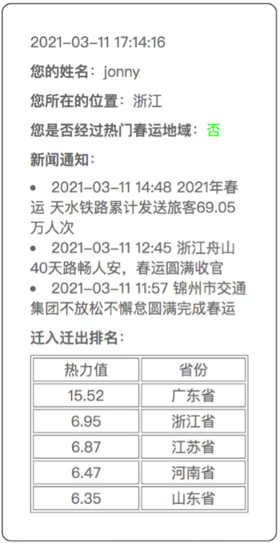

## 界面

## 设计

1. 用户信储采用**Hash**存储。
2. 地理位置信息判断采用**Tair**性能增强型结构**TairGis**。
   1. 因为**Redis**原生的**GEO**不具有点与面关系判断的功能，无法实现此功能。
   2. 主要用到的API为：
      1. `GIS.CONTAINS`：判断用户在哪个省。
      2. `GIS.INTERSECTS`：判断用户是否经过热门春运地域。
3. 新闻通知（本地简报）功能采用**Stream**，给用户推送实时消息。
   1. 主要用到的API有两个:
      1. `XADD`：添加消息。
      2. `XREVRANGE`：遍历返回消息。
4. 迁入迁出排名采用**Sorted Set**。
   1. 因为**Sorted Set**本身按照`score`排序，因此极大的简化了开发逻辑，可以直接按照顺序返回。
   2. 主要用到的API有两个：
      1. `ZADD`：添加省份及对应的热力值。
      2. `ZREVRANGE`：按照倒序返回信息。

