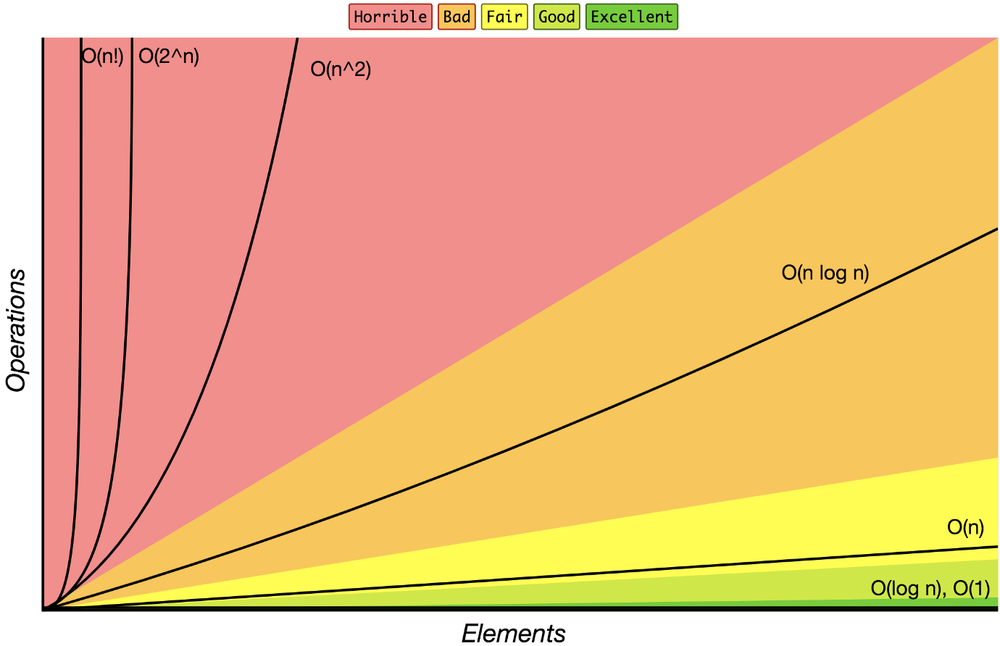

## 时间复杂度[[1]](https://www.toutiao.com/a6592811242052649476/)

若存在函数`f(n)`，当`n`趋近于无穷大时，`T(n)/f(n)`的极限值为不等于零的常数，则称`f(n)`是`T(n)`的同数量级函数。

记作`T(n)=O(f(n))`，称`O(f(n))`为算法的**渐进时间复杂度**，简称**时间复杂度**。

**时间复杂度**用大写`O`来表示，所以也被称为大`O`表示法。

## 推导法则

1. 如果运行时间是常数量级，用常数1表示。
2. 只保留时间函数中的最高阶项。
3. 如果最高阶项存在，则省去最高阶项前面的系数。

## 常见函数

`O(1)` < `O(logn)` < `O(n)` < `O(n*logn)` < `O(n^2)` < `O(2^n)` < `O(n!)`

