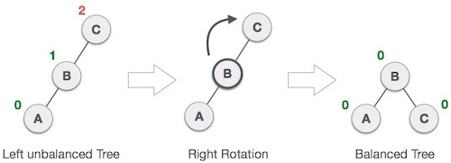
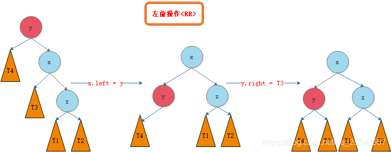

## 二叉查找树

[二叉查找树](https://zh.wikipedia.org/wiki/二元搜尋樹)是符合以下特点的二叉树：

1. 左子树上所有节点的值均比根节点的值要小。
2. 右子树上所有节点的值均比根节点的值要大。
3. 任意节点的左右子树也为**二叉查找树**。

## AVL树

[AVL树](https://baike.baidu.com/item/AVL树/10986648)是最早的自平衡**二叉查找树**，树中任何节点的左右子树的高度相差不超过`1`，因此也被称为**高度平衡树**。

向**AVL树**中增加和删除节点，可能需要进行一次或多次旋转来重新平衡。

> **AVL树**得名于其发明者G. M. Adelson-Velsky和E. M. Landis。
>
> 平衡，指的是树的任意节点的子树的高度差都小于等于`1`。

### 旋转[[1]](https://blog.csdn.net/u014453898/article/details/112390002)

平衡树的旋转是从失去平衡的最小子树的根节点开始的，即，离插入节点最近且平衡因子超过1的祖节点。

树的旋转包括左旋和右旋：

- ##### 左旋，逆时针旋转
  
  
  
- ##### 右旋，顺时针旋转
  
  

### 四种失衡[[2]](https://blog.csdn.net/qq_25343557/article/details/89110319)

#### LL型

- 在不平衡节点的左子节点的左子节点处插入了节点。
- 需要右旋一次。

#### RR型

- 在不平衡节点的右子节点的右子节点处插入了节点。
- 需要左旋一次。

#### LR型

- 在不平衡节点的左子节点的右子节点处插入了节点。
- 先左旋再右旋。

#### RL型

- 在不平衡节点的右子节点的左子节点处插入了节点。
- 先右旋再左旋。

## 红黑树

**红黑树**除了是一种自平衡**二叉查找树**外，主要具有以下特点：

1. 节点是红色或者黑色。
2. 根节点为黑色。
3. 所有叶节点为黑色。
4. 每个红色节点必须有两个黑色节点。（即，每个叶节点到根节点的的所有路径上不能有两个连续的红色节点。）
5. 从任一节点到其每个叶节点的所有简单路径都包含相同数量的黑色节点。

这些约束条件保证了**红黑树**的重要特性：从根到叶的最长可能路径不会多余最短可能路径的2倍。

查找效率为`logN`。

> Java的`HashMap`、`ConcurrentHashMap`都采用了**红黑树**来提升效率读性能。
