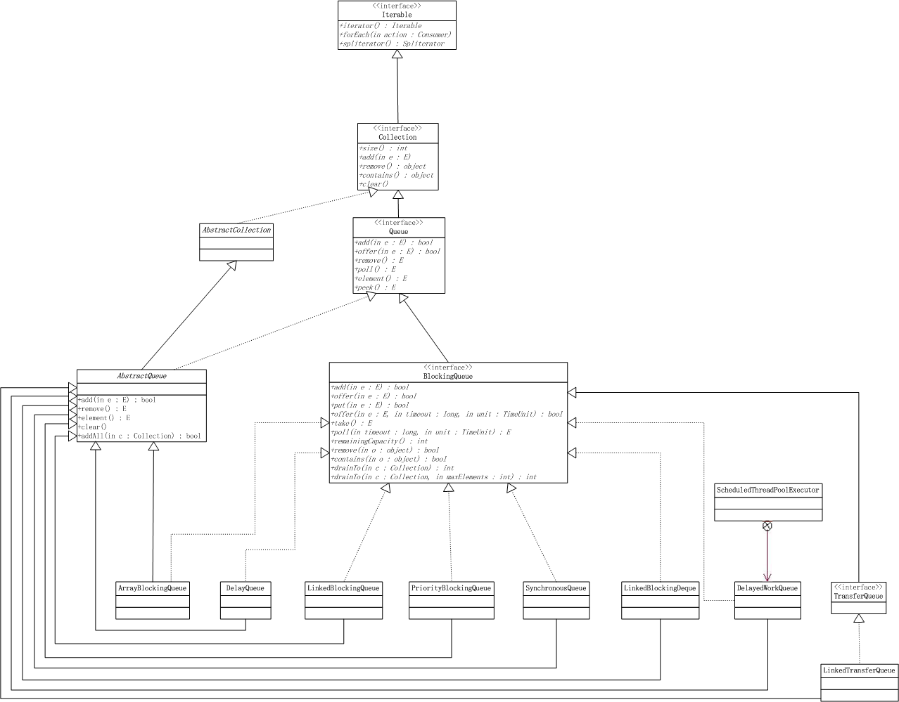

Java集合类历史悠久，历经多次变化，存在以下遗留类：HashTable、Vector、Stack、Enumeration（已由Iterator取代）。

由于历史遗留问题，**Properties**类实际上是用**HashTable**来存储，从**JDK9**开始，**Properties**文件支持指定文件编码了。

1. 可以反复调用Properties.load()来加载配置文件，并把已经存在的key的value给覆盖掉。

遍历集合的时候推荐使用**Iterator**，这样统一、无需知道集合内部结构、遍历速度较快。

1. 编写Iterator时常用一个**内部类**来实现该接口。
2. 设计模式中的迭代器模式。

**Collections**类提供了一系列实用方法：

1. 创建空集合。
   1. List.of()（JDK9）也能方便地创建空集合、创建单元素集合，返回的是**定长**数组。
2. 创建单元素集合。
3. 创建不可变集合。
4. 排序、洗牌操作。

### Collection

**Collection**是除**Map**外，所有集合类（List、Set）的根接口。

**CopyOnWriteArrayList**是线程安全的List，写操作在一个**复制**的数组上进行，在写入时加锁，在读取时不加锁。

1. 因为进行了读写的分离，所以允许写的同时进行读。
2. 这样的设计增加了内存的占用，并造成了数据的不一致，所以不适合实时性高的场景。

有多种方法支持数组转换为ArrayList：

1. Arrays.asList()
2. Arrays.stream()
3. List.of(1, 3, 7)（JDK9）

ArrayList转数组可通过调用List.toArray(new String[0])方法完成。

### Map

使用**SortedMap**时，必须实现**Comparable**接口。

**HashSet**实际上是用**HashMap**来实现的。

### Queue

**Queue**的接口的方法都有两套，一套是抛出异常，一套是返回真假。

不能放入null值，因为队列为空时，也会返回null。

**Queue**有[多种](https://docs.oracle.com/en/java/javase/15/docs/api/java.base/java/util/Queue.html)实现类：

1. [阻塞式](https://www.cnblogs.com/duanxz/p/3400003.html)：
   1. ArrayBlockingQueue：有界；出队、入队使用同一个锁对象，可能是因为已经够轻巧了，采用分离锁会增加复杂度，得不偿失。
   2. DelayQueue：带定时，用的少；阻塞出队，不阻塞入队。
   3. LinkedBlockingQueue：相当于无界；采用分离锁；出队、入队时，**ABQ**不会产生额外的对象，但**LBQ**需要将对象封装成节点，需要考虑对**GC**的影响。
   4. LinkedBlocking**Deque**：双向。
   5. LinkedTransferQueue。
   6. PriorityBlockingQueue：会阻塞出队，不会阻塞入队，所以需要预防**OutOfMemoryError**。
   7. SynchronousQueue：不是一个真正的队列，因为没有容量（线程安全），只是对数据的使用权进行交接，或者说传递；公平模式下采用FIFO来阻塞多余的生产者、消费者，非公平模式（默认）下采用LIFO来管理多余的生产者、消费者。
2. 非阻塞式：AbstractQueue、Array**Deque**、ConcurrentLinked**Deque**、ConcurrentLinkedQueue、**LinkedList**、PriorityQueue

向**PriorityQueue**传入的元素需实现**Comparable**接口，或者传入**Comparator**对象。

[下图](https://www.cnblogs.com/duanxz/p/3400003.html)为阻塞队列：

### Deque

**Deque**，Double Ended Queue，双端队列，扩展自**Queue**接口。

1. **Deque**虽然扩展自**Queue**，但使用Deque时推荐使用offerFirst()、peekLast()等方法。

**Deque**实现类有**ArrayDeque**、**LinkedList**。

1. **LinkedList**既实现了**List**接口，也实现了**Deque**（**Deque**又扩展自**Queue**接口）。

### Stack

**Stack**类继承自**Vector**，属于历史遗留类，不推荐使用。

主要是因为**Vector**时不时地需要扩容，并且包含大量同步方法，效率低。ArrayList不是也需要按1.5倍扩容吗？

要使用栈，可以用**Deque**。

进制转换、中缀表达式、后缀表达式计算都可以用栈来实现。