### Atomic

<span style=background:#b3b3b3>java.util.concurrent.atomic.*</span>，原子操作封装类，通过**volatile**+**CAS**+**自旋**来实现线程安全访问。

**AtomicInteger**主要有3个属性：

1. <span style=background:#e6e6e6>volatile int value</span>，实际的值。
2. <span style=background:#e6e6e6>static final Unsafe unsafe</span>，获取并操作内存的数据。
3. <span style=background:#e6e6e6>static final long valueOffset</span>
   1. value属性相对于AtomicInteger的首地址的偏移量，之后的自增自减是直接对内存进行操作的，所以需要内存偏移量。
   2. 对于一个确定的运行环境，其valueOffset是固定不变的，但这不代表着可以写死。因为对于不同的开发环境，比如32位JVM和64位JVM，它俩的valueOffset就不同，所以采用了这种编码的形式，而没有直接写死。

Java8提供LongAdder、LongAccumulator来应对多线程高度竞争的场景。


### JUC与AQS

**JUC**（<span style=background:#b3b3b3>java.util.concurrent.\*</span>）提供了很多并发工具类，它们都是基于**AQS**实现的，比起直接使用<span style=background:#b3b3b3>Object.wait()/wait(long)</span>、<span style=background:#b3b3b3>Object.notify()/notifyAll()</span>要方便得多。

<span style=background:#b3b3b3>ThreadPoolExecutor.Worker</span>也是利用**AQS**同步状态，实现对独占线程变量的设置（tryAcquire()、tryRelease()）。

[3种常见的并发控制工具](http://blog.sina.com.cn/s/blog_7d1968e20102xewm.html)：

1. **CountDownLatch**
   1. 子任务完成后通知主任务。
   2. 每完成一个子任务就调用<span style=background:#b3b3b3>CountDownLatch.countDown()</span>（<span style=background:#e6e6e6>Sync.tryReleaseShared()</span>），将<span style=background:#c2e2ff>未完成的子任务数</span>（count）减一，当count归零后，主线程会从<span style=background:#b3b3b3>CountDownLatch.await()</span>（<span style=background:#e6e6e6>Sync.tryAcquireShared()</span>）中醒来。<span style=background:#c2e2ff>未完成的子任务数</span>需要<span style=background:#c9ccff>预设</span>。
   3. 可应用于并发处理一张excel里的多个sheet。
2. **CyclicBarrier**
   1. 子任务完成后通知主任务。
   2. 可循环使用的（Cyclic）内存屏障（Barrier）。当子任务到达一个屏障，即<span style=background:#b3b3b3>CountDownLatch.await()</span>处，也称同步点）时会被阻塞，直到所有的子任务都到达屏障时，阻塞才会接触。<span style=background:#c2e2ff>子任务数</span>同样需要<span style=background:#c9ccff>预设</span>。
   3. 可以设置当所有子任务都到达屏障时，要执行的动作。
3. **Semaphore**
   1. 可用于共享资源数量的控制，比如数据库连接数、接口的每秒最大请求数。<span style=background:#c2e2ff>资源数量</span>同样需要<span style=background:#c9ccff>预设</span>。
   2. <span style=background:#b3b3b3>Semaphore.acquire()</span>，减少计数，<span style=background:#e6e6e6>Sync.tryAcquireShared()</span>。
   3. <span style=background:#b3b3b3>Semaphore.release()</span>，增加计数，<span style=background:#e6e6e6>Sync.tryReleaseShared()</span>。

并发读写锁：

1. **ReadWriteLock**

   1. **ReadWriteLock**是一种悲观锁，允许在没有写入时，多个线程并发读；但在读时不允许写入。
   2. **ReadWriteLock**适合读多写少的场景。
   3. 在创建**ReadWriteLock**后，需要先获取读锁或写锁，然后才能加锁，如，<span style=background:#b3b3b3>ReadWriteLock.readLock().lock()</span>。
   4. 其实现类**ReentrantReadWriteLock**，使用<span style=background:#b3b3b3>AQS.state</span>的高16位保存写锁持有的次数，低16位保存读锁的持有次数。
   5. 不允许锁的升级，允许降级。

2. **StampedLock**

   1. **StampedLock**是一种乐观锁，于Java 8引入，也用于并发读写，它与**ReadWriteLock**的最大不同在于<u>支持读时写入</u>。
   2. <u>支持读时写入</u>意味着读取的数据可能不一致，所以**StampedLock**需要额外检测数据是否一致，若不一致则将乐观读升级为悲观读。
   3. **StampedLock**的写锁不可重入，读锁可重入。

   ```java
   // StampedLock的使用说明：
   long stamp = stampedLock.tryOptimisticRead(); // 加乐观锁
   …… // 读取
   if(!stampedLock.validate(stamp)){ // 检测数据是否一致
       stamp = stampedLock.readLock(); // 升级为悲观锁
       try{
           …… // 重新读取
       }finally{
           stamped.unlockRead(stamp); // 解锁
       }
   }
   …… // 业务代码
   ```

 [下图](https://www.infoq.cn/news/java-memory-model-5)为JUC框架的层级结构：




### [锁的分类](https://tech.meituan.com/2018/11/15/java-lock.html)

1. 乐观锁和悲观锁。

   1. <span style=background:#c2e2ff>乐观锁</span>，认为读的过程中大概率不会有写，基于**CAS**。
   2. <span style=background:#c2e2ff>悲观锁</span>，认为读的过程中有写，写入需要等待读取完成。
2. 公平锁和非公平锁。

   1. 公平与否的标准在于是否允许<span style=background:#c2e2ff>插队</span>。
   2. 插队能提高效率（吞吐量）。
3. 可重入锁和不可重入锁。

   1. 可重入的意思是允许同一持锁者<span style=background:#c2e2ff>重复加锁</span>，不会产生死锁。
   2. 我们所遇到的锁<span style=background:#c2e2ff>绝大部分</span>都是可重入的。
4. 共享锁和排他锁。
   1. **读**过程可以是**共享**的，也可以**排他**的，但**写**过程只能是**排他**的。
   
   2. 并发**读**的过程很难感知到数据的更新，所以**共享锁**往往只允许并发**读**，不允许**写**。
   
   3. **独占锁**，也称**排他锁**。独占可以是完全的，即只允许持锁者**读写**，也可以是不完全的，即只允许持锁者**写**，但允许其他人**读**。
   
      > MySQL中的独占锁是完全独占的。
   
   4. 共享锁，又称**S锁**（Shared）；排他锁，又称**X锁**（Exclusive）。
5. 偏向锁、轻量级锁、重量级锁。


### 死锁

死锁可从3个方面预防：

1. 破坏互斥条件
1. 破坏占用和等待条件
   1. 使用同一个锁对象。
1. 破坏不可抢占条件
   1. 即中断阻塞，所以**Lock**可破坏，**synchronized**无法破坏。
   2. 支持超时。
   3. 非阻塞地获取锁，获取锁失败时直接返回，不进入阻塞状态。
1. 破坏循环等待条件
   1. 当多个线程持有不同的锁，并试图获取对方已持有的锁时，就会无限等待，即死锁。
   1. 有序加锁：多线程按照统一的顺序获取锁，能防止死锁。


### 分布式锁

[How to do distributed locking?](https://martin.kleppmann.com/2016/02/08/how-to-do-distributed-locking.html)

#### MySQL

有3种实现方式：

1. 加锁时，往数据库中插入一条数据，其中方法名为<u>唯一索引</u>；解锁时，删除该条数据。

2. 通过修改锁记录的状态来加锁 / 解锁，需保证查询时触发索引来加行锁，否则只会加表锁。

   ```sql
   SELECT ... FROM lock_table WHERE method_name = ? FOR UPDATE
   ```

3. 基于乐观锁，每次更新时令<u>版本字段</u>自增。

不可重入的问题可通过先查询再插入来解决。

基于**MySQL**的分布式锁实现简单，但是：

1. **MySQL**会成为性能瓶颈。
2. **MySQL**如果采用单点，则存在容灾风险；如果采用主从，又存在数据不一致。
3. 没有锁失效机制，存在死锁，需设置<u>失效字段</u>定期清理。
4. 没有阻塞机制，业务代码只能自旋。

#### Redis

有2种实现方式：

1. 直接使用命令：`SETNX`加锁，`DEL`解锁，`EXPIRE`设置失效时间。
2. 使用Redisson + Lua实现：公平锁、联锁、红锁（**Red Lock**）、读写锁。

**Redis**性能好，但是锁的失效时间没有通用设置：过短，会导致业务逻辑没执行完；过长，会降低并发量。

1. 可通过`WATCH`进行监视，锁失效时，若业务逻辑仍未执行完，则延长失效时间。

#### **Zookeeper**

通过创建临时节点来加锁。

> **Apache Curator**是**Netflix**开发的**Zookeeper**客户端。
>
> **Curator**简化了原生**Zookeeper**客户端的开发，包括：重连、反复注册watcher、异常处理等，可用来开发分布式锁。

**Zookeeper**的会话机制保证了锁的可重入性。

**Zookeeper**有良好的**Consistency**、**Partition Tolerance**，但在选举时会违反**Availability**。
