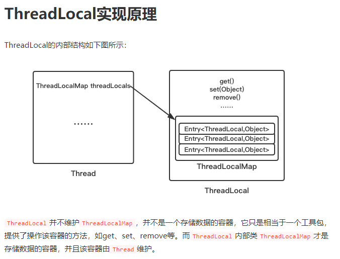
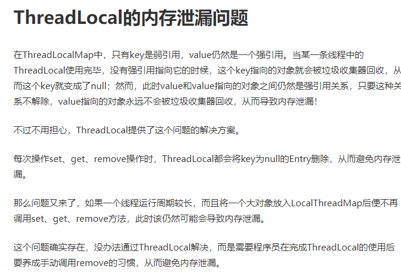
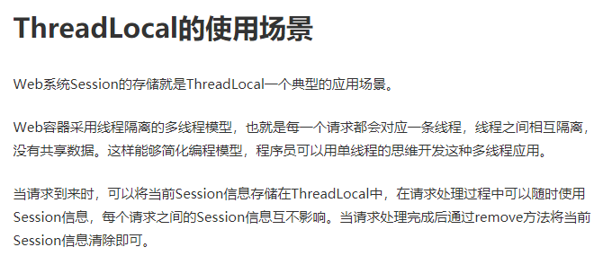

### ThreadLocal实现原理

ThreadLocal不是真正存储数据的地方，其内部类ThreadLocalMap才是，ThreadLocal的key不是Thread是ThreadLocal。


### ThreadLocal的内存泄漏问题

```java
static class Entry extends WeakReference> {
    Object value;
    Entry(ThreadLocal k, Object v) {
        super(k);
        value = v;
    }
}
```

可以看出，key为弱引用，value为强引用。

并且ThreadLocal是key。

所以当TheadLocal使用完毕，也就是没有强引用指向该ThreadLocal（key）时，ThreadLocal只剩弱引用，会被清理，key也就变为null了；

但是value和value指向的对象仍为强引用，不会被回收，从而导致内存泄漏。

ThreadLocal清楚这点，所以在set、get、remove方法内都会将key为null的Entry删掉，避免内存泄漏。

当然，如果不调用这些方法，则无法解决，这也是为什么要求使用完ThreadLocal后要remove的原因。


### ThreadLocal的使用场景

将Servlet中的Session保存到ThreadLocal中就是ThreadLocal的一个典型使用场景。

Servlet为每个请求创建一个线程，线程之间相互隔离。

将当前的Session保存到ThreadLocal中，就可以在请求处理过程中随时使用Session中的信息，处理完成后调用remove方法清理即可。






