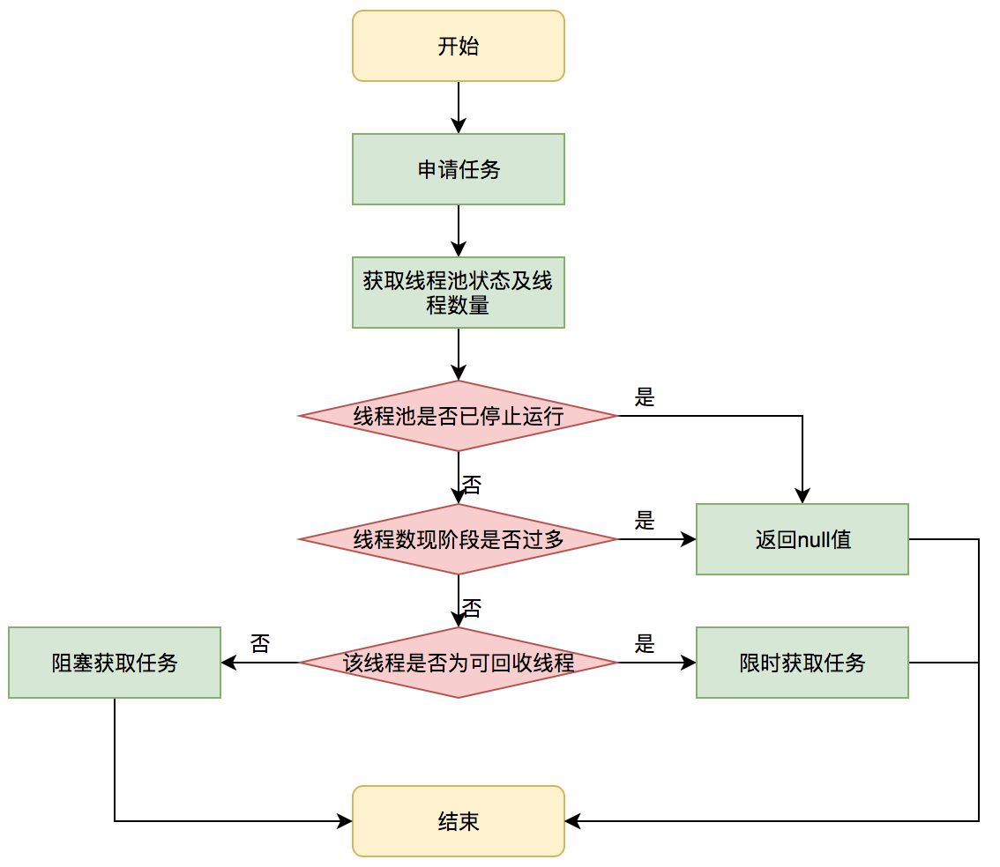

任务管理主要有以下4个方面：

1. **任务调度**

   Executor.execute()，即任务调度，是[线程池](https://tech.meituan.com/2020/04/02/java-pooling-pratice-in-meituan.html)的主要入口，也是线程池的核心，其具体过程为：

   1. 若线程池运行状态不为Running，则拒绝执行任务，执行**拒绝策略**。
   2. 若线程池运行状态为Running，且workerCount < corePoolSize，则**创建并启动**一个线程来执行任务。
        1. 该情况仅出现在线程初始创建的时候。
   3. 若workerCount >= corePoolSize，且“**任务列表**未满”，则将任务放入队列等待执行。
      1. 新线程执行完任务变为空闲后，就会不停从队列中获申请任务，然后执行任务。
   4. 若任务列表已满，且workerCount < maximumPoolSize，则**创建并启动**一个线程来执行任务。
   5. 若任务列表已满，且workerCount >= maximumPoolSize，则拒绝执行任务，执行**拒绝策略**。

   

2. **拒绝策略**

   [拒绝策略](https://www.cnblogs.com/skywang12345/p/3512947.html#a1)是一个接口类，其主要实现类有：

   | **名称**                                                     | **描述**                                                     |
   | ------------------------------------------------------------ | ------------------------------------------------------------ |
   | AbortPolicy                                                  | **默认策略**。丢弃任务，并抛出**RejectedExecutionException**异常。因为能反馈异常信息，适合关键业务。 |
   | DiscardPolicy                                                | 丢弃任务，不抛出异常。没有反馈信息，适合不重要的业务。       |
   | DiscardOldestPolicy                                          | 丢弃任务列表最前面的任务，然后重新提交被拒绝的任务。视实际需要使用。 |
   | [CallerRunsPolicy](https://www.imooc.com/wenda/detail/479495) | 由启动线程池的线程运行多出来的任务。确切的说是，阻塞该线程，而运行多出来的任务，其他的任务需要排队等待。 |

3. **任务列表**

   1. 引入任务列表（WorkQueue），是为了控制线程数量。
   2. 任务列表实际上是一个阻塞队列（BlockingQueue），该队列有两个附加操作：
      1. 在队列为空时，消费任务的线程会等待队列变为非空。
      2. 当队列满时，生产任务的线程会等待队列可用。
   3. Java线程池支持[多种阻塞队列](https://blog.csdn.net/xx326664162/article/details/51701508)：

      | **名称**                                                     | **与线程池**                                                 |
      | ------------------------------------------------------------ | ------------------------------------------------------------ |
      | ArrayBlockingQueue                                           | 能防止资源耗尽，但使用复杂，故JDK不推荐使用该队列。          |
      | DelayQueue                                                   | 延迟时间可设置。**ScheduledThreadPool**采用了该队列。        |
      | LinkedBlockingQueue                                          | 无界队列可以使**maximumPoolSize**参数失效。 **FixedThreadPool**、**SingleThreadExecutor**采用了该队列。 |
      | LinkedTransferQueue LinkedBlockingDeque PriorityBlockingQueue | 略                                                           |
      | SynchronousQueue                                             | 该队列常要求**maximumPoolSize**是有限的。**CachedThreadPool**采用了该队列。 |
   
4. **获取任务**

   1. 比起直接创建新线程执行任务，现有线程空闲后从任务列表中申请并执行任务要更普遍，而这部分任务的申请由ThreadPoolExecutor.getTask()来完成，流程如下：

      

   2. 需要强调的是，线程是否回收也是根据getTask()返回结果是否为空。