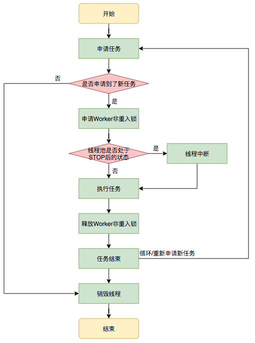

线程管理主要包括以下4个方面：

1. **Worker线程**

   1. 线程管理包括掌握线程的状态、维护线程生命周期等2方面，为此在[线程池](https://tech.meituan.com/2020/04/02/java-pooling-pratice-in-meituan.html)设计了一种线程：

      ```java
      private final class Worker extends AbstractQueuedSynchronizer implements Runnable{
          final Thread thread; // Worker持有的线程
          Runnable firstTask;  // 初始化任务，可以为null
      }
      ```
      
     2. <span style=background:#b3b3b3>Worker.thread</span>变量用于执行任务。由调用Worker的构造方式时通过调用<span style=background:#b3b3b3>getThreadFactory().newThread()</span>创建。

     3. <span style=background:#b3b3b3>Worker.firstTask</span>变量表示初始化任务，可为空：

        1. 若不为空，线程创建启动后会立即执行该任务。
        2. 若为空，线程创建启动后会去任务列表中获取任务。

     4. **Worker**通过继承**AQS**来实现独占锁，实现不可重入特性来反映线程的执行状态：

        1. 调用lock()成功获取独占锁，表示当前线程正在执行任务，不应中断该线程。
        2. 如果该线程不是独占锁的状态，表示当前线程空闲，可以被中断。
        3. 线程池在执行<span style=background:#c2e2ff>shutdown()</span>、<span style=background:#c2e2ff>tryTerminate()</span>时会调用<span style=background:#c2e2ff>interruptIdleWorkers()</span>来中断空闲线程，<span style=background:#c2e2ff>interruptIdleWorkers()</span>会调用<span style=background:#c2e2ff>tryLock()</span>来判断线程池中的线程是否为空闲状态，若是，则将该空闲线程安全回收。

2. **创建线程**
   1. 调用<span style=background:#b3b3b3>ThreadPoolExecutor.addWorker(firstTask, core)</span>即可增加**Worker**。
   
   2. **firstTask**可为空。
   
   3. **core**为布尔变量：
   
      1. 为true时，新增线程时会判断“<span style=background:#c2e2ff>workerCount < corePoolSize</span>”是否成立。
      2. 为false时，新增线程时会判断“<span style=background:#c2e2ff>workerCount < maximum</span>”是否成立。
   
   4. 具体创建过程为：
   
      

3. **回收线程**
   
   1. 线程池使用一张**HashSet**保存对**Worker**的引用，通过增删引用的方式来控制**Worker**的生命周期。
   
   2. 当**Worker**创建出来后，就会通过不停地轮询来获取任务。
   
      ```java
      try{
          while (task != null || (task = getTask()) != null) {
              …… // 执行任务
          }
      } finally {
          processWorkerExit(w, completedAbruptly);
      }
      ```
   
   3. 核心线程会以阻塞形式获取任务，所以不会被回收（前提是未开启核心线程超时）；非核心线程会以限时阻塞的形式获取任务，限定时间内未能获取到任务，则会被回收。
   
      1. 线程池中的线程核心线程与非核心线程之间并没有区别，仅是逻辑概念，在回收过程中存活下来的就称作核心线程。这次存活下来的核心线程，在之后的运行过程
   
      ```java
      private Runnable getTask(){
          boolean timed = allowCoreThreadTimeOut || wc > corePoolSize; // 开启允许核心线程超时（空闲时不保留任何线程），或者运行线程数超过了核心线程数
          if ((wc > maximumPoolSize || (timed && timedOut)) // 超过最大线程数，或者超时了        
              && (wc > 1 || workQueue.isEmpty())) {
              if (compareAndDecrementWorkerCount(c)) return null;
              continue;
          }
          Runnable r = timed ?
              workQueue.poll(keepAliveTime, TimeUnit.NANOSECONDS) : // 非核心线程以限时阻塞的方式获取任务
          	workQueue.take(); // 核心线程以阻塞的形式获取任务
          if (r != null) return r;
          timedOut = true;
      }     
      ```
   
   4. 当线程获取不到任务时，会执行<span style=background:#c2e2ff>processWorkerExit()</span>，会主动从HashSet中移除自身的引用，之后JVM会自动回收（销毁）该**Worker**，具体销毁过程为：
   
      
   
   5. 在销毁过程中，线程池需要判断销毁原因，判断自身当前状态，最终确定是否要重新分配线程。


4. **执行任务**

   通过调用<span style=background:#b3b3b3>Wokrer.run(){runWorker()}</span>来执行任务，其具体流程为：
   
   
      1. 不停轮询，通过调用<span style=background:#c2e2ff>getTask()</span>从任务列表中获取任务。
    2. 如果线程池正在停止，则要保证当前线程是中断状态；否则保证当前线程不是中断状态。
   3. 执行任务。
   4. 如果<span style=background:#c2e2ff>getTask()</span>获取结果为空，则停止轮询，销毁线程。

   
