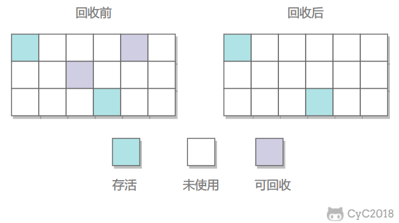
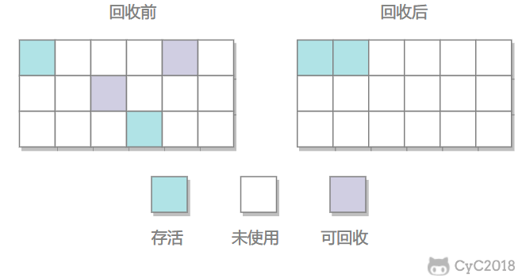
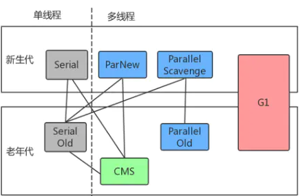

### 垃圾收集

Garage Collection，GC，发生在**堆**、**方法区**。而**栈**、**程序计数器**属于线程私有，随线程销毁而销毁。

判断对象是否存活的标准是对象是否被引用，可分为：

1. **引用计数法**
   1. 为对象添加引用计数器，有引用时加1，引用失效时减1。
   2. 无法解决循环引用问题。
2. **可达性分析法**
   1. 以GC Roots为起点进行搜索，不可达的对象代表未被引用。
   2. **GC Roots**包括：
      1. **虚拟机栈**、**本地方法栈**中引用的对象。
      2. **方法区**中**常量**、**静态变量**引用的对象。

**方法区**主要是对**常量池**的回收和对类的卸载。类卸载需要满足3个条件，并且满足了也不一定会被卸载：

1. 类的所有实例已被回收。
2. 类的加载器已经被回收。
3. 类的Class对象不再被引用。

### [引用类型](https://zhuanlan.zhihu.com/p/70699720)

1. ##### 强引用
   
   1. 被**强引用**的对象不会被回收。
   2. 引用通过**new**关键字创建出的对象都是**强引用**（FinalReference）。
2. ##### 软引用
   
   1. 被**软引用**的对象在内存不足时才会被回收。
   2. 引用通过**SoftReference**类创建出的对象都是**软引用**。
3. ##### 弱引用
   
   1. 被**弱引用**的对象一定会被回收，即只能存活于下次垃圾回收发生前。
   2. 引用通过**WeakReference**类创建出的对象都是**强引用**。
4. ##### 虚引用
   
   1. 被**虚引用**的对象的回收与否与是否被**虚引用**无关，为对象设置**虚引用**仅仅是为了对象被回收时能收到系统通知。
   2. 引用通过**PhantomReference**类创建出的对象都是**虚引用**。

### 垃圾收集的方法

1. 标记清除法
   
   1. 对需要回收的对象Mark Word进行标记，然后进行清除。回收后的空间会放入空闲链表中，如果空间连续则合并，分配空间时查询空闲列表。
   
   2. 效率低、碎片空间大。
   
      
   
2. 标记整理法

   1. 将存活的对象移向一段，然后回收端边界以外的内存。

   2. 效率低。

      

3. 复制法

   1. 将内存均分为两块，每次只是用其中的一块，当一块用完后就将还存活的对象移动到另一块，然后清空这块内存。

   2. 空间利用率低。

      

4. ##### 分代法

   1. 将3**堆**分为**Young**和**Old**：

      1. **Young**采用复制法。
      2. **Old**采用标记清除法（**SO**、**PO**）或标记整理法（**CMS**、**G1**）。
   2. **Young**又按“**8：1：1**”的比例分为伊甸区、幸存者1区、幸存者2区，这样内存的利用率能达90%。
   1. 但如果存活的对象如果多于10%，Survivor就不够用了，需要**Old**进行空间分配担保。

   

   

### 垃圾收集器

HotSpot共有7种垃圾收集器，除**CMS**、**G1**外，其他收集器都会与用户程序交替执行，既需要停顿用户程序。停顿，Stop The World，STW。

**Young**收集器有：

1. ##### Serial

   1. 串行执行。
   2. Client场景下默认的新生代收集器
   3. 一两百兆的垃圾可与100毫秒内完成收集。
   
2. ##### ParNew

   1. Serial的并行版。
   2.  Server场景下默认的新生代收集器。
   3. 可配合**CMS**使用。
   
3. ##### Parallel Scavenge

   1. 并行处理。
   2. 停顿时间短，适合用户交互场景，是以牺牲**Young**空间、吞吐量换来的，所以回收也会频繁。

**Old**收集器有：

1. ##### Serial Old

   1. **Serial**的**Old**版本。
   2. 可搭配**Parallel Scavenge**使用。

2. ##### Parallel Old

   1. **Parallel** **Scavenge**的**Old**版本。

3. ##### CMS，Concurrent Mark Sweep

   回收过程分为4个阶段：

   1. 初始标记，Initial Mark
      1. 只是对**GC** **Roots**能直达的对象进行标记。
      2. 需要停顿，但是停顿时间短。

   2. 并发标记，Concurrent Mark
      1. 进行**可达性分析**，持续时间长。
      
   3. 重标记，Remark
      1. 修正并发标记期间，程序的变动。
      2. 需要停顿。

   4. 并发清除，Concurrent Sweep

   **CMS**有以下缺点：

   1. 停顿短，所以吞吐量低。
   2. <u>Concurrent Mode Failure</u>
      1. 并发清除时用户程序产生的垃圾叫做”浮动垃圾“，需要为”浮动垃圾“预留出一部分内存，所以**CMS**在**Old**快要满时就需要回收垃圾。如果预留的空间不够，就会发生”Concurrent Mode Failure“，这时**Serial Old**就会出面摆平，然后深藏功与名。
   3. 标记清除法会带来空间碎片，导致没有足够大的连续空间，进而提前触发**Full GC**。

4. ##### G1，Garbage First

   将**堆**划分成多个大小相等的区域（Region），**Young**和**Old**再隔离。

   整体看是标记整理法，局部看是复制法
   
   回收过程分为4个阶段：
   
   1. 初始标记
   2. 并发标记
   3. 最终标记
      1. 并发标记阶段的对象变化会记录在Remember Set Logs中，并在本阶段合并到Remember Set中。会停顿。
   4. 筛选回收
      1. 对各个**Region**的回收价值和成本进行排序，按用户期望的停顿时间回收。

### 内存分配

1. 优先分配到**Eden**。
2. 大对象直接分配到**Old**。
3. 长期存活的对象移动到**Old**。
4. 动态年龄判断，当有相同年龄的对象大小之和大于**Survivor**大小的一半时，大于等于该年龄的对象会移入**Old**。

### 回收策略

**Minor** **GC**，只回收**Young**，执行频繁、执行速度快。

1. 当**Eden**空间不够时，会发起**Minor GC**

**Full** **GC**，回收**Young**和**Old**，**Old**中的对象存活时间旧，所以很少执行、执行速度慢。

1. 调用System.gc()
   1. 建议JVM进行一次**Full GC**，JVM不一定会执行。
2. **Old**空间不足
   1. 往往是因为大对象、长期存活的对象太多引起的。
3. 永久代空间不足（Java8之前的版本）。
4. 发生”Concurrent Mode Failure“时。
5. 空间分配担保失败
   1. 在**Minor** **GC**之前，JVM会检查**Old**的最大可用连续空间是否大于**Young**所有对象大小之和，如果是，则担保成功（**Minor** **GC**安全）；
   2. 如果否，则担保失败，JVM会查看HandlePromotionFailure的值是否允许冒险，如果允许则检查**Old**的最大可用连续空间是否大于历次晋升到**Old**的对象的平均大小，如果是，则尝试进行此次**Minor GC**，如果否，则进行一次**Full GC**。
   3. 如果不允许冒险，也会进行**Full GC**。