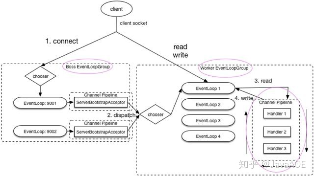

### 核心类

1. Channel，管道，接口类，提供基本的I/O操作，以及bind、connect、read、write等操作。
   1. 常见的两个实现类而NioServerSocketChannel（服务端）和NioSocketChannel（客户端）。
2. EventLoop，事件循环，定义了Netty的核心抽象，用于处理Channel的生命周期中的所有事件。
3. EventloopGroup，一组EventLoop。
4. ChannelFuture，类似于java中的Future类，提供异步的结果响应。
5. ChannelHandler，真正处理数据的类。
6. ChannelPipeline，由一组ChannelHandler组成的调用链。
7. Bootstrap、ServerBootstrap ，服务端、客户端的启动引导类，负责对象的创建、初始化、连接的建立关闭、端口的绑定等。
8. IdleStateHandler，维护心跳，让对方（客户端或者服务端）知晓自己的存活。

