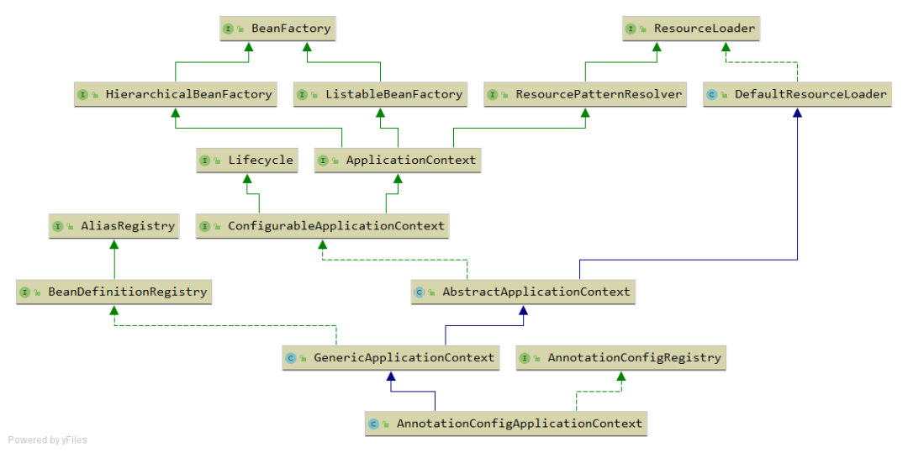
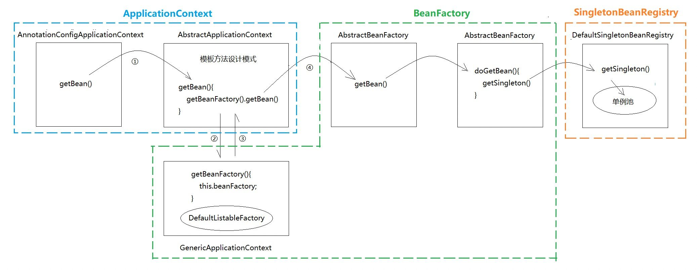
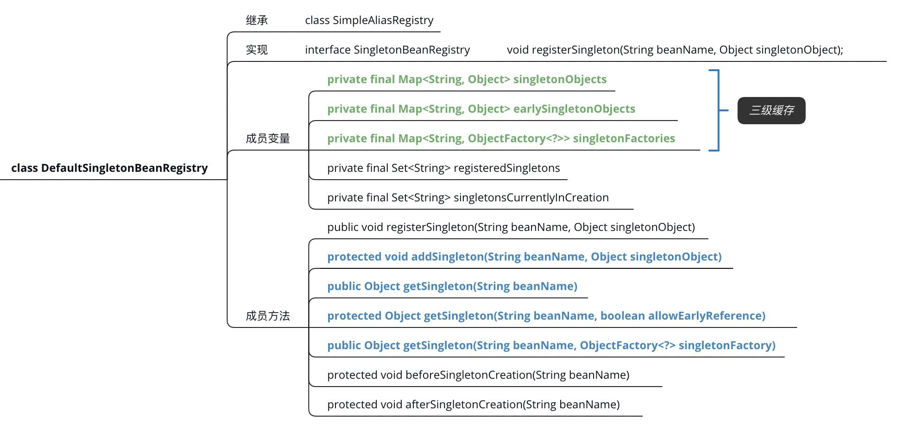

以**AnnotationConfigApplicationContext**为例，以BeanFactory.getBean()为线索探究IoC容器中[各类之间的关系](https://zhuanlan.zhihu.com/p/74832770)。

public interface ApplicationContext extends EnvironmentCapable, ListableBeanFactory, HierarchicalBeanFactory, MessageSource, ApplicationEventPublisher, ResourcePatternResolver {}

public interface ConfigurableApplicationContext extends ApplicationContext, Lifecycle, Closeable {}

public abstract class AbstractApplicationContext extends DefaultResourceLoader implements ConfigurableApplicationContext {

  public Object getBean(String name)  {

​    return this.getBeanFactory().getBean(name);

  }

}

public class GenericApplicationContext extends AbstractApplicationContext implements BeanDefinitionRegistry {

​    private final DefaultListableBeanFactory beanFactory; // 组合

​    public final ConfigurableListableBeanFactory getBeanFactory() {

​        return this.beanFactory;

​    }

}

public  class DefaultListableBeanFactory extends AbstractAutowireCapableBeanFactory implements ConfigurableListableBeanFactory, BeanDefinitionRegistry, Serializable {}

public abstract class AbstractAutowireCapableBeanFactory extends AbstractBeanFactory implements AutowireCapableBeanFactory {} // 创建Bean的功能

public abstract class AbstractBeanFactory extends FactoryBeanRegistrySupport implements ConfigurableBeanFactory {} // 实现一系列操作IoC容器的功能

public abstract class FactoryBeanRegistrySupport extends DefaultSingletonBeanRegistry {}

public  class DefaultSingletonBeanRegistry extends SimpleAliasRegistry implements SingletonBeanRegistry { // 真正担任容器的类

​    private final Map\<String, Object\> singletonObjects; // 一级缓存，保存实例化、注入、初始化完成的Bean。

​    private final Map\<String, Object\> earlySingletonObjects; // 二级缓存，保存实例化完成的Bean。

​    private final Map\<String, ObjectFactory\<?\>\> singletonFactories; // 三级缓存，用于保存Bean创建工厂，以便创建代理对象。

​    private final Set\<String\> singletonsCurrentlyInCreation; // 用于保证单例，防止重复创建

}

public interface BeanDefinitionRegistry extends AliasRegistry {} // 定义了与**BeanDefinition**相关的方法

public interface ConfigurableListableBeanFactory extends ListableBeanFactory, AutowireCapableBeanFactory, ConfigurableBeanFactory {} // 定义了缓存**BeanDefinition**、与实例化单例**Bean**的方法

public interface ConfigurableBeanFactory extends HierarchicalBeanFactory, SingletonBeanRegistry{} // 可配置的**BeanFactory**，定义了各种配置能力，如作用域、类加载器、后置处理器、创建状态等

public interface SingletonBeanRegistry {} // 定义了对单例缓存池的操作，如将**Bean**注册到单例缓存池中

public interface ListableBeanFactory extends BeanFactory {} // 表示这些**Bean**可罗列，定义了一系列获取**Bean**的方法

public interface HierarchicalBeanFactory extends BeanFactory {} // 表示这些**Bean**是有继承的

public interface AutowireCapableBeanFactory extends BeanFactory {} // 定义**Bean**的自动装配规则（byType/byName），以及**Bean**生命周期相关的方法

public interface BeanFactory {} // BeanFactory被分成了3各子接口，但它们最终的默认实现类都是DefaultListableBeanFactory，这样做是为了区分**Spring**在内部操作过程中对象的传递和转换