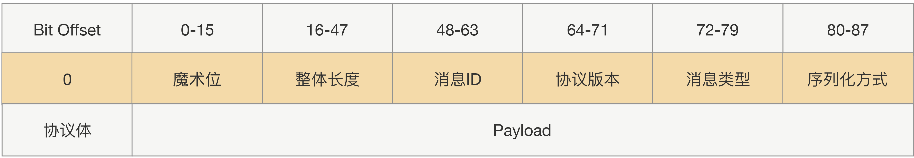

RPC，Remote Procedure Call，通过隐藏复杂的底层网络协议，让远程调用变得像本地调用。

RPC是一种模型，Java的RMI是其一种实现。

RPC是设计主要有3点：

1. 服务寻址

2. 数据流序列化 / 反序列化

   1. JSON
      1. JSON内存开销大；且没有类型，需要通过反射进行类型转换。
   2. Hessian
      1. 生成的字节数少；不支持Java中的基于链表的数据结构，Byte/Short反序列化是会变成Integer。
   3. Protobuf
      1. 二进制，高效，但不可读。可用Protostuff代替。

3. 网络传输

   1. 绝大部分RPC实现都使用TCP，而非HTTP，因为HTTP的请求头体积太大，并且无状态。

   2. 传输协议分为定长协议、不定长协议：

      

另外需要注意：

1. 类要尽量简单，最好不要有依赖关系、继承关系。
2. 对象体积不要太大，不要穿大集合。
3. 尽量选择语言原生对象。
