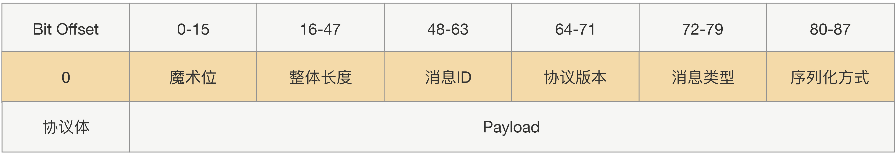
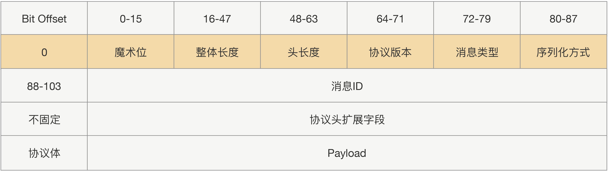

### RPC

RPC，Remote Procedure Call，通过隐藏复杂的底层网络协议，让远程调用变得像本地调用。

既然是调用，调用方就需要传递方法名、参数类型、参数值，被调用方将结果返回。

**RPC**是一种模型，Java的**RMI**是其一种实现。

**RPC**是设计主要有3点，

1. 服务寻址

2. 数据流序列化 / 反序列化

   1. JSON
      1. JSON内存开销大；且没有类型，需要通过反射进行类型转换。
   2. Hessian
      1. 生成的字节数少；不支持Java中的基于链表的数据结构，Byte/Short反序列化是会变成Integer。
   3. Protobuf
      1. 二进制，高效，但不可读。可用Protostuff代替。

3. 网络传输

   1. 绝大部分**RPC**实现都使用TCP，而非HTTP，因为HTTP的请求头体积太大，并且无状态。

   2. 传输协议分为定长协议、不定长协议。定长效率高，但不够灵活。

      

另外需要注意，

1. 类要尽量简单，最好不要有依赖关系、继承关系。
2. 对象体积不要太大，不要穿大集合。
3. 尽量选择语言原生对象。

### Guava

**Guava**是一个由“Google对Java6的一系列扩展”组成[的项目](https://www.cnblogs.com/peida/archive/2013/06/08/3120820.html)，包括：

1. com.google.common.annotations，普通注解类型。
2. com.google.common.base，基本工具类库和接口。
3. com.google.common.cache，缓存工具包，非常简单易用且功能强大的JVM内缓存。
4. com.google.common.collect，带泛型的集合接口扩展和实现，以及工具类，这里你会发现很多好玩的集合。
5. com.google.common.eventbus，发布订阅风格的事件总线。
6. com.google.common.hash， 哈希工具包。
   1.  Bloom filters。
7. com.google.common.io，I/O工具包。
8. com.google.common.math，原始算术类型和超大数的运算工具包。
9. com.google.common.net，网络工具包。
10. com.google.common.primitives，八种原始类型和无符号类型的静态工具包。
11. com.google.common.reflect，反射工具包。
12. com.google.common.util.concurrent，多线程工具包。
    1. ListenableFuture，可监听的异步回调。
      2. Service， 控制事件的启动和关闭，为你管理复杂的状态逻辑。
