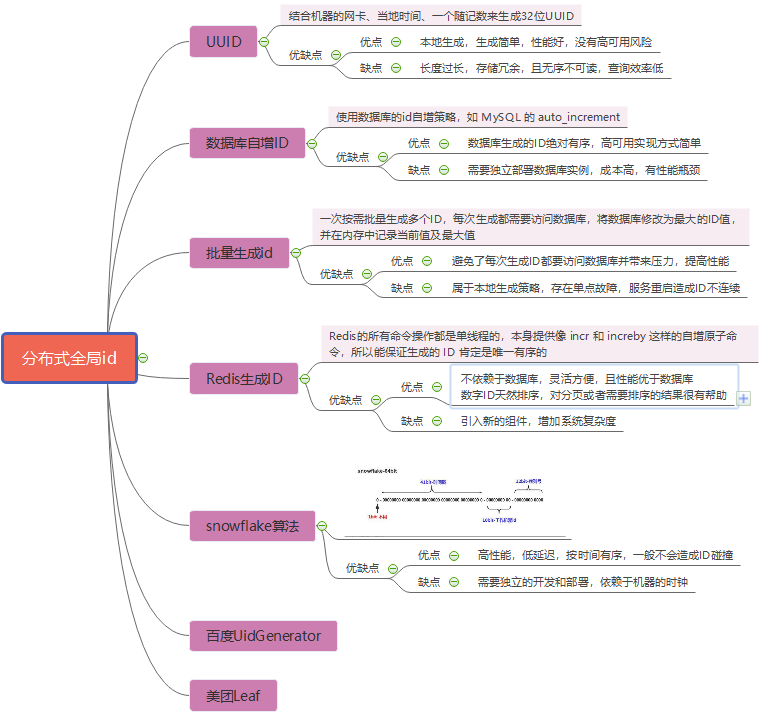

### 基本组成

SQL，Structured Query Language，有3部分：

DDL，Data Defind Language，定义数据，即添加表、删除表、修改表结构。

DML，Data Manipulation Language，添加删除更新数据。

DQL，Data Query Language，查询数据。


### 主键

主键不能带有业务信息，可以为自增型或GUID。

1. 自增主键的类型如果为INT，可以存储21亿（2^31)条数据，
2. 如果是BIGINT，则可以存储922亿亿（2^63)条数据。

除非有必要，才使用联合主键。联合主键会提升表之间的复杂度。

int(M): M indicates the maximum display width for integer types.


### 外键

外键约束可以保证无效的数据无法插入，但是会降低性能，往往是通过应用程序来实现约束。


### 分布式ID

1. 订单链路
   1. 调用**Zookeeper**生成全局唯一性ID，并组合：10位时间、4位类型区分（订单号、流水号）、**Zookeeper**生成的ID为分布式ID。
2. 领卡逻辑
   1. 用数据库批量生成，每次生成200个卡号，然后放入内存，并在内存中记录当前值和最大值，减少对**Mysql**的压力。




### 索引

想要某一列的值在插入时唯一，有以下2种方式：

1. 唯一索引，不允许作为外键

   ```sql
   ALTER TABLE table_name ADD UNIQUE INDEX idx_column(column_name)
   ```

2. 唯一约束，允许作为外键

   ```sql
   ALTER TABLE table_name ADD CONSTRAINT unique_column UNIQUE (column_name)
   ```

   2. 在MySQL中，唯一约束实际上是用唯一索引实现的，会创建一个唯一索引，两者在使用上没有区别。

两种方式都允许为null，另外MySQL中null不允许和null作比较，null == null和null != null均为false。

《[高性能MySQL](https://read.douban.com/reader/ebook/35648568/)》（书籍，146页）


### 分页——Limit

<span style=background:#b3b3b3>LIMIT [offset],[rows]</span>的另一种写法是<span style=background:#b3b3b3>LIMIT [rows] OFFSET [offset]</span>

对**LIMIT**来说，**offset**越大，查询速度越慢。

1. 这是因为LIMIT实际上是将offset+rows条数据全部查出，然后将前offset条数据全部丢弃。


我们可以根据业务需要借助索引列来排序。

[MySQL order by limit 分页数据重复问题](https://www.jianshu.com/p/544c319fd838)：

1. LIMIT经常会搭配ORDER BY使用，但如果排序字段包含重复数值，MySQL不会处理重复值之间的顺序，即无序的，返回顺序依赖具体的执行计划。
2. 这就会造成如果某页正好在这些重复值中截断，会导致所谓的分页数值重复问题。

解决方法很简单：

1. 为排序字段添加索引。
2. 将一个绝对有序，也就是没有重复值的字段加入到排序列中，往往会选择主键，这样排序结果就会变为绝对有序。

> If you combine LIMIT row_count with ORDER BY, MySQL stops sorting as soon as it has found the first row_count rows of the sorted result, rather than sorting the entire result. 
>
> <span style=background:#ffee7c>这个“entire result”指的究竟是只是行，还是包含列？</span>


### SQL优化

[一些实用（冷门）SQL](https://www.liaoxuefeng.com/wiki/1177760294764384/1246617682185952)

如“不存在则插入，否则更新”、“插入或替换”、“插入或忽略”，从查询结果中插入，强制使用指定索引等。

<span style=background:#ffee7c>mysql的单机峰值多少？</span>

MySQL虽然也是分布式系统，但是它的热点问题主要是<span style=background:#ffee7c>热点行更新</span>的问题。

[Mysql大并发热点行更新的两个骚操作](https://www.cnblogs.com/wangiqngpei557/p/11962760.html)


