### InnoDB Buffer Pool

磁盘的读写速度远不如内存，数据库如果每次读写都直接操作硬盘，其速度只能比🐢还慢，所以数据库都会在内存中设置<u>缓存</u>、<u>缓冲</u>以减少磁盘IO。（本篇主要参考自[文章](https://mp.weixin.qq.com/s/uyu0lKz2_N5BYgITKz71CQ)）

**MySQL**的默认存储引擎为**InnoDB**，而**InnoDB**的<u>缓存</u>、<u>缓冲</u>为**Buffer Pool**。

一个**Buffer Pool**一次只能允许一个线程来操作（操作过程会加锁），但是可以设置多个**Buffer Pool**来提升并发量。

1. innodb_buffer_pool_size，**Buffer Pool**的总大小，默认为128MB。

2. innodb_buffer_pool_instance，**Buffer Pool**的个数。

3. innodb_buffer_pool_chunk_size，默认大小为128MB。
   1. **Buffer Pool**以块（Chunk）为单位。
   2. **Buffer Pool**支持动态扩容，扩容时不会直接申请一大块连续的空间，而是以Chunk为单位，申请多个Chunk。
   3. 另外**Buffer Pool**不是越大越好，一般为50%~60%，剩下的空间供系统、其他程序使用。

**Buffer Pool**有3个重要概念：Free List、Flush List、LRU List。

在介绍这3个重要概念之前，我们先介绍1个基本概念——数据页。

### 数据页

1. 在数据库中，我们都是以“表+行”为逻辑单位来操作数据，但**MySQL**实际上都是以页为单位来操作数据，每页大小默认16KB。
2. 无论磁盘中的数据，还是**Buffer Pool**中的数据，均以页为单位进行组织。
3. **InnoDB**还会为**Buffer Pool**中的每个**数据页**额外开辟一些空间，用于保存数据页<u>所属表空间</u>、<u>数据页页号</u>等部分元数据，所占空间约为数据页的15%（800B）。
4. 所以**InnoDB**在启动时，会在内存中申请一块比innodb_buffer_pool_size略大的连续空间，多申请的空间就是用于存储这些元数据。

### Free List

**Buffer Pool**使用两种数据结构来管理空间：

1. Hash Table
   1. 记录<u>已使用</u>的**数据页**。
   2. 键，为表空间号+数据页号。
   3. 值，为数据页地址。
   4. 多个**Buffer Pool**会共用一个**Hash Table**，即多个**Buffer Pool**中的数据不会有重复。
   
2. Free List
   1. 记录<u>空闲</u>的**数据页**，是一个双向链表。
   2. 确切的说，Free List由空闲**数据页**的部分元数据组成。
   3. Free List还有一个基础节点，用于引用该双向链表的头节点、尾节点、节点个数。

### Flush List

**Buffer Pool**不仅扮演着**读缓存**的角色，还扮演着**写缓冲**的角色。

**InnoDB**的**增删改查**操作都是先在**Buffer Pool**中进行的，操作之后内存中的部分**数据页**就与硬盘中相应的**数据页**就不一致了，内存中的这部分数据页也称作**脏页**。

**InnoDB**通过Flush List来记录这些**脏页**，确切的说，Flush List由**脏页**的部分元数据组成。

当**脏页**被后台线程刷写到磁盘中后，**InnoDB**就会释放该页所占空间，即将该页从Flush List移除，同时添加到Free List中。

### LRU List

内存空间终归是有限的，当其空间不足时，我们往往会将**最近最少使用**（Least Recently Used，LRU）的数据淘汰掉。

**Buffer Pool**也不例外，它采用LRU List，一个双向链表来实现**LRU**，链表节点由**数据页**的部分元数据组成，具体使用过程为：

1. 新加载的**数据页**的会按照加载顺序插入到LRU List的头部。
2. 当空间不足时，**InnoDB**就会将LRU List尾部的数据页刷入硬盘，腾出空间。

### 预读取机制

**MySQL**的**预读取**机制：

1. 大致过程

   1. 查询一个**数据页**时，往往也需要查询与该页<u>相邻</u>的**数据页**，所以为了减少读取次数，**InnoDB**会将数据页及其<u>相邻</u>的**数据页**一并加载到**Buffer Pool**中。
   2. **预读取**机制似乎只是**InnoDB**中的概念，**MyISAM**以文件预读的方式预热数据。

2. 两种类型：

   1. innodb_read_ahead_threshold，线性预读，默认值为56。如果顺序访问了某一个区里的多个数据页，且**数据页**数量达到该阈值，就会进行预读取，把下一个相邻区中的所有数据都加载到**Buffer Pool**中。
   2. innodb_random_read_ahead，随机预读，会带来不必要的麻烦，**MySQL5.5**已基本废弃该功能。

不难看出，**预读取**机制虽然能减少总体的读取次数，但是这些<u>相邻页</u>的使用率远低于其对应的数据页，会造成：

1. **Buffer Pool**空间的浪费。
2. 其他使用率高的**数据页**会被挤兑到LRU List的后端，进而被淘汰。

诚然，数据使用频率不一致的问题，也就是<u>冷热数据</u>现象，是数据存储领域的自然现象，**预读取**机制只是加剧了这一问题。

**Buffer Pool**采用<u>冷热分离</u>的方式来解决这一个问题。

### LRU List的冷热分离

**InnoDB**将LRU List分为**冷数据区**、**热数据区**。

数据页加载到**Buffer Pool**中后会被放入**冷数据区**的头部，如果一段时间延迟后，该**数据页**被再次访问，才会被移动到**热数据区**的头部。

这个过程涉及两个参数：

1. innodb_old_blocks_pct，**热数据区**的占比，默认为37%。

2. innodb_old_blocks_time，时间延迟长短，默认为1000毫秒。
   1. 刚加载到**Buffer Pool**中的数据在短时间内被重复访问的概率较高，但超出一定时间后概率就会降低，因此时间延迟的设置能有效区分<u>冷热数据</u>。
   2. 全表扫描等操作会加载大量数据到**Buffer Pool**中，时间延迟的设置能有效防止<u>热数据</u>被挤出**Buffer Pool**，即防止**Buffer Pool**被污染。

那么**热数据区**中的数据页被访问后，是否应该移动到表头？

1. 答案是否。

2. 因为**热数据区**的**数据页**本身就会被频繁访问，如果每次都移动到表头，只会徒增开销、降低性能。

3. 所以**Buffer Pool**的LRU List的**热数据区**中：
   1. **数据页**如果在**数据区**的前25%，被访问时不会被移动。
   2. **数据页**如果在**热数据区**的后75%，被访问时才会被移入到**热数据区**的头部。

   

### [脏页的刷盘](https://blog.csdn.net/qq_42604176/article/details/116460433)

1. **InnoDB**通过buf_LRU_get_free_block()获取**Buffer Pool**中的空闲空间。
   1. buf_LRU_get_free_block()会访问Free List，从中获取空闲空间，如果获取失败，则会尝试淘汰LRU List中的数据页。
   2. buf_LRU_get_free_block()会循环执行上述过程，直到获取到足够的空闲空间，所以在高负载情况下会加剧Free List与LRU List的**mutex**的竞争。
   
3. **InnoDB**设置了独立线程来负责**Buffer Pool**中脏页的刷盘，以避免用户线程同步刷脏，提升用户线程的响应速度。

3. 并且**InnoDB**将Free List（Flush List）与LRU List的刷脏分开，以避免两者相互影响、降低性能。两者的刷盘分别由不同的线程负责：

   1. page_cleaner_thread，负责将Flush List中引用的脏页进行刷盘，并将刷盘后的空闲空间放入Free List，LRU List中对应的**脏页**也会被移除。
      1. 以单线程方式执行。
      2. 每次刷写**脏页**的时间间隔sleep time是自适应的，会根据当前的**LSN**（Log Sequence Number）、Flush List的oldest_modification、当前的同步刷脏点进行调整。
      3. 每次刷写**脏页**的数量也是自适应的，会根据系统中**脏页**的比例、Redo Log的产生速度、其他几个参数进行调整。
      4. 如果page_cleaner_thread刷盘不及时，就会调用buf_LRU_get_free_block()来获取空间，进而出现上面<u>1.2</u>中的竞争问题，降低性能。
      5. 如果page_cleaner_thread刷盘过快，会占用大量IO，也有可能降低性能。

   2. lru_manager_thread，负责将LRU List中引用的脏页的刷盘。
      1. 以多线程方式执行。
      2. 每次刷写**脏页**的时间间隔是自适应的，会根据Free List的长度与max_free_len（= innodb_LRU_scan_depth \* innodb_buf_pool_instances）的大小关系进行调整。
      3. 每次刷写脏页的数量是固定的，由innodb_LRU_scan_depth变量决定。
   
4. 其他刷盘时机请阅读《5.4 日志》章节中的《脏页的刷盘时机》。

1. **InnoDB**读写过程：

   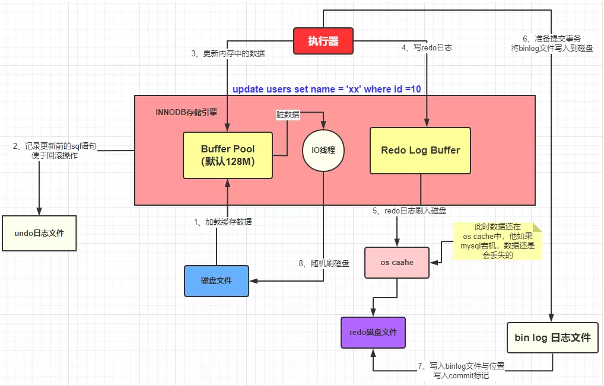

2. **Buffer Pool**由**Chunk**组成：

   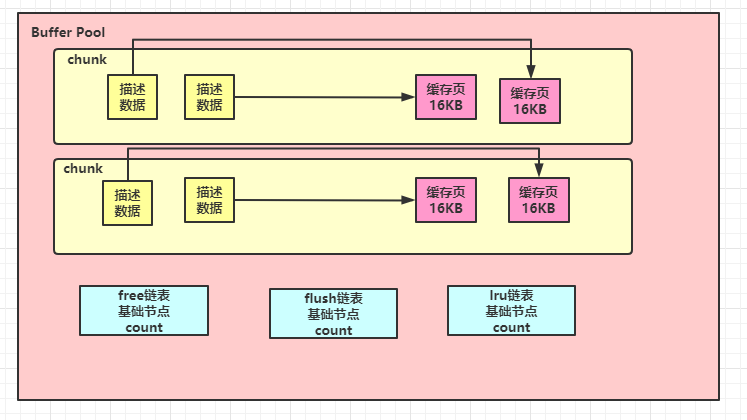

3. 多个**Buffer Pool**与他们的**Chunk**：

   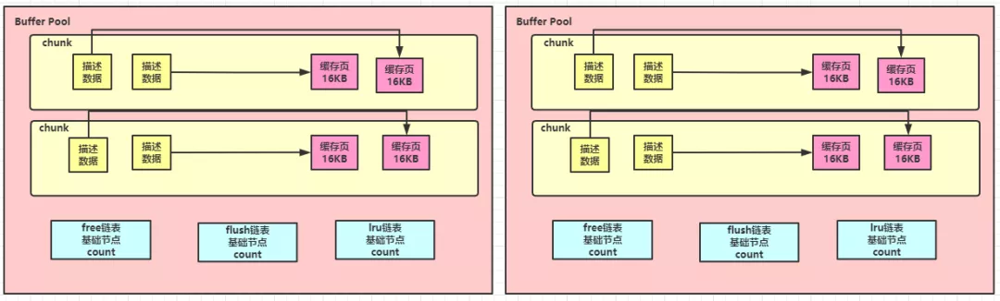

4. **数据页**：

   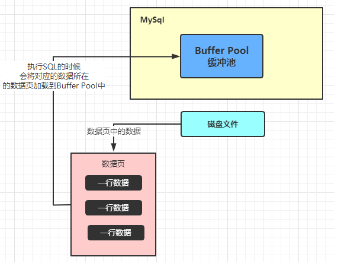

5. **Buffer Pool**中的**数据页**：

   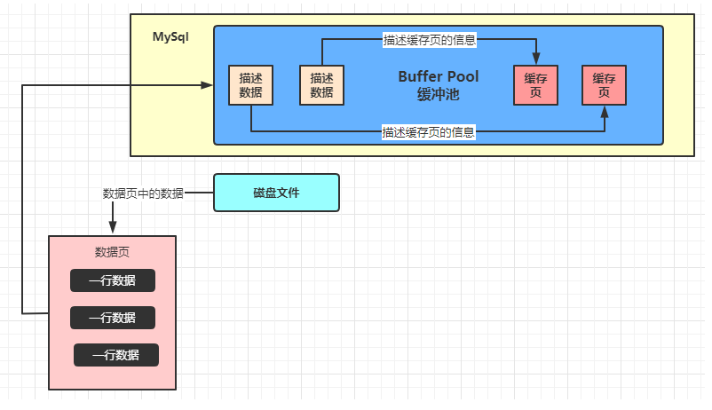

6. Free List：

   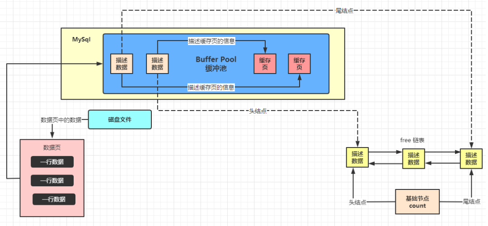

7. Flush List：

   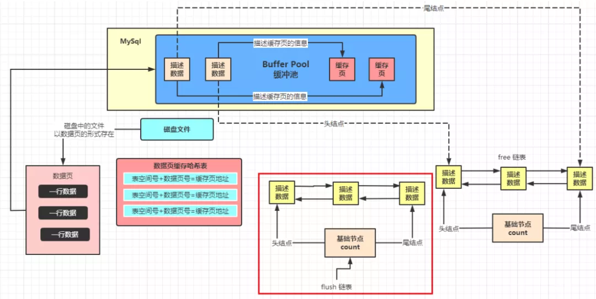

8. 数据库不停地增删改查：

   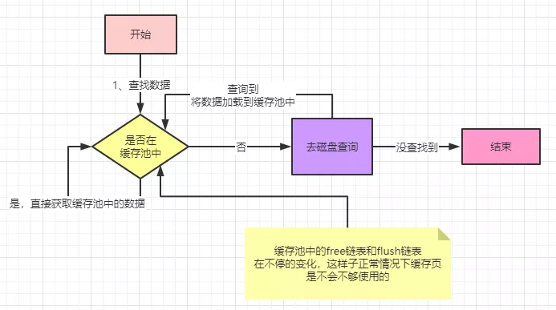

9. LRU List的工作过程：

   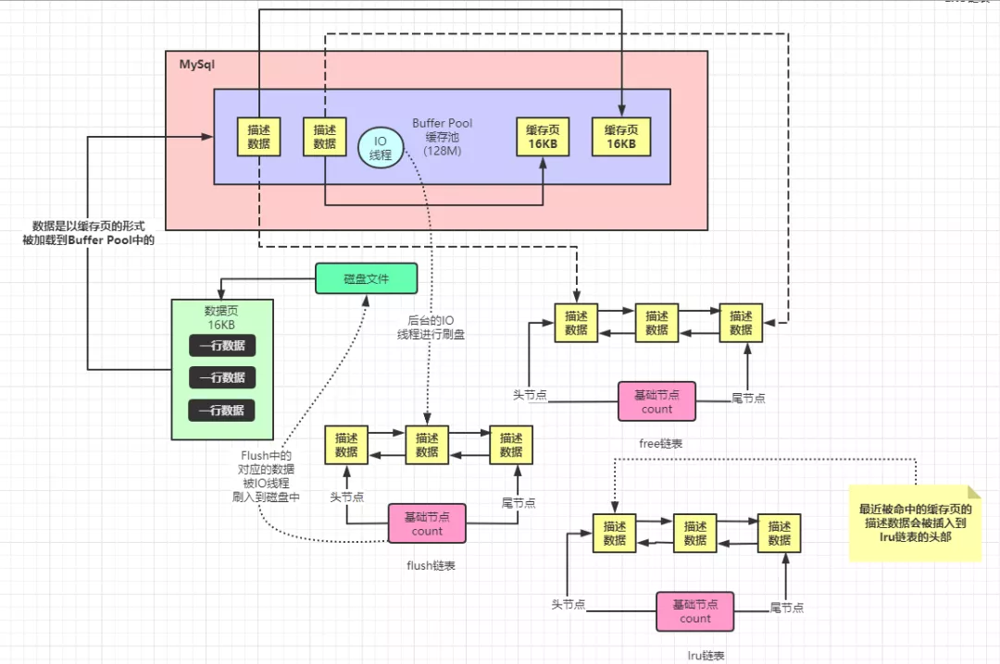

10. 预读取与LRU List：

    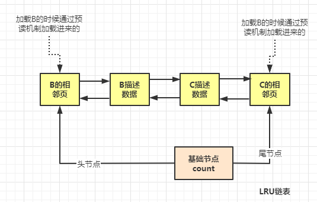

11. LRU List的<u>冷热分离</u>：

    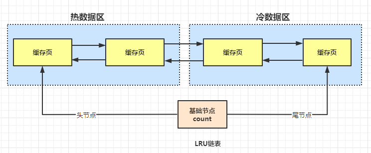

12. 后台线程将<u>冷数据区</u>的尾节点对应的数据页刷入磁盘：

    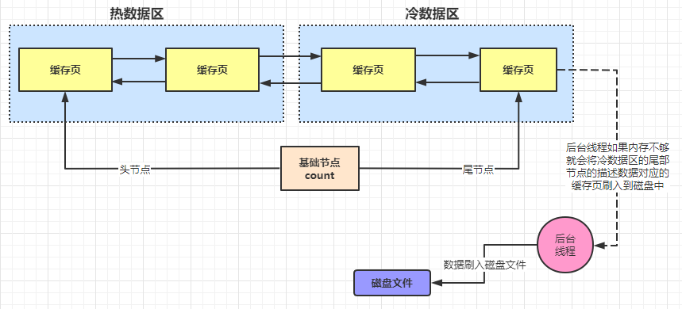

13. 无