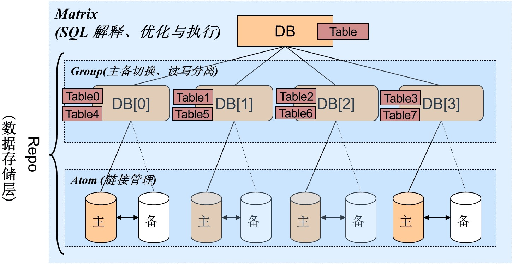

### 从极限说起

MySQL单表数据达到2000万时，性能会下降，[之所以是2000万，主要跟B+树有关。](https://zhuanlan.zhihu.com/p/355302417)

> 假设每条记录大小为 <u>1KB</u>，那么一张 <u>16KB</u> 的数据页可以保存 <u>16</u>条记录；
>
> 再假设主键为bigint，长 <u>8Byte</u>，而InnoDB的指针为 <u>6Byte</u>，即一共<u>14Byte</u>；
>
> 那么一张数据页可以索引 <u>16*1024 / 14 = 1170</u> 张数据页，也就是 <u>1170 * 16 = 18720</u> 条记录，此时树高为 <u>2</u>；
>
> 如果树高为 <u>3</u>，则可以索引 <u>1170 * 1170 * 16 = 21902400</u> 条记录，也就是大约2000万条，此时需要3次左右的IO，因为根节点一般被缓存，所以实际IO次数会小于3；
>
> 所以，当记录总数超过2000万时，IO次数就会由小于3变为小于4，并且缓存池可能也会失效，因而引发性能陡降。
>
> 更精准的计算参照[另一篇文章](https://blog.hufeifei.cn/2020/04/13/Alibaba/TDDL/#5-shui-ping-fen-ku-fen-biao)

我们可以通过适当拆分——[分库分表](https://www.cnblogs.com/butterfly100/p/9034281.html)，来对其性能进行优化。

> 分库分表仅作为系统优化的**最终手段**，不到万不得已不使用，以避免**过度设计**，应先考虑<u>优化索引</u>、<u>读写分离</u>、<u>升级硬件</u>、<u>升级网络</u>。

另外，分库分表一定程度上还能缓解锁的竞争。

### [范式设计](https://baike.baidu.com/item/%E8%AE%BE%E8%AE%A1%E8%8C%83%E5%BC%8F/894217)

#### 第一范式

每个字段都是不可分割的，确定行的确定字段不能有多个只，不能有重复字段。

#### 第二范式

每行记录被唯一地区分，通常是通过主键来区分。

#### 第三范式

表中不能包含其他表种办函的非主键信息。

### 读写分离

绝大部分业务都是读多写少，此时可以增加若干从库（Slave）来分担原有数据库（主库，Master）的访问压力。

**Slave**存储与**Master**同样的数据，但只提供读操作，写操作、事务仍然走**Master**。

在此基础上还能实现容灾，当**Master**宕机后，可将某一**Slave**切换为**Master**。

读写分离后，面对多个库，程序应该能分辨读操作、写操作，进而选择要访问的数据库。

> 连接池中间件Druid提供SQL解析，能分辨读操作、写操作。

### 分库分表

#### 垂直切分

垂直切分也称竖切，是将表中不常用的字段、关联性低的字段、大字段都拆分到另一张表中，从而减少核心数据的体积，从而减少IO，也能稍微缓解热点问题。

往往只是库内分表，有时也会跟微服务结合进行分库分表。

竖切会增加`JOIN`、事务的复杂度。

#### 水平切分

水平切分也称横切，直接按照数值（时间、用户ID等）将表切分，或将数值取模切分。

1. 按数值切分无法解决热点问题，因为较大数值的数据（如近期，新注册的用户）往往是热点数据，而大数值的数据还是会集中在一起。
2. 对数值的Hash值取模切分能解决热点问题，但是会增加跨片查询的复杂度，并且最好使用[一致性Hash](https://segmentfault.com/a/1190000021199728)，不然后期不好扩容。

虽然可以只库内分表，竞争的还是同一台机器的CPU、内存、网络等资源，所以往往会分库分表。

横切后：

1. 跨库的`JOIN`性能较差。
   1. 使用全局表，即每个库中都会保存该表。
   2. 字段冗余，空间换时间，反范式设计。
   3. 数据组装，分两次查询，程序进行组装。
   4. 将有关联的记录放在同一分片。
2. 跨分片的分页、排序、聚合函数也会变得复杂。
   1. 分片进行运算后，程序将结果汇总，然后再次运算，返回结果。
3. 跨分片的事务（分布式事务）比起单机事务往往更复杂、更慢。
   1. 为保证一致性，需要协调多个节点，也就更复杂，执行时间也就更长。
   2. 根据需要可选择强一致性，还是最终一致性。

#### 负面影响

分库分表

1. 数据库备份，会占用大量磁盘IO和网络IO。
2. 修改大表的DDL，会锁表，影响业务访问。

分库分表后，后端架构也需要作相应调整，以适应表结构的变化。

#### 中间件

##### 当当的[Sharding Sphere](https://shardingsphere.apache.org/document/current/cn/overview/)

可理解为增强版的JDBC Driver或数据库代理，完全兼容JDBC（支持方言）、各种ORM框架、任何第三方连接池。

能获取数据库的访问流量，提供：

1. 流量重定向：数据分片、读写分离、影子库。
2. 数据变形：数据加密、数据脱敏。
3. 数据鉴权：安全、审计、权限。
4. 流量治理：限流、熔断。
5. 流量分析：服务质量、可观察性。

##### 阿里的Taobao Distribute Data Layer，TDDL

1. 该中间件实现了JDBC规范，引入方便。

   

2. 架构主要包含3层：

   1. **Matrix**
      1. 实现分库分表。
      2. SQL的解释、优化、执行。
      3. 规则管理。
      4. Atom执行结果合并。
   2. **Group**
      1. 读写分离、主备切换。
      2. 权重选择、重试。
   3. **Atom**
      1. 数据源信息（IP、Port、Password）管理，并支持动态修改。
      2. 连接池管理（Druid）

   

### 千万级数据的导入导出

千万级数据的导入导出，需要在传输过程中对<u>**内存使用空间**</u>和<u>**磁盘的流量**</u>进行限制，同时还需增加监控，动态调整导入 / 导出程序对<u>**内存**</u>、<u>**磁盘**</u>的使用情况。

另外，最好在分库分表的基础进行。

### 分布式ID

对数据库分库分表后需要有一个唯一ID来标识一条记录：

1. 全局唯一，最基本的要求。
2. 趋势递增，大部分的数据库都使用了基于B树的数据结构来存储数据，主键的有序能保证读写性能。
3. 单调递增，以满足事务版本号、增量消息、排序的需要。
4. 信息安全，如果ID是连续的，则很容易被恶意用户掌握数据量。

[常见方案](https://zhuanlan.zhihu.com/p/107939861)：

1. UUID

   1. 分为5段，8-4-4-4-12共36个字符。
   2. **优点**：本地生成，没有网络损耗。
   3. **缺点**：过长且无序，从而不易存储，作为主键会降低数据库读写性能；包含MAC信息，有泄露MAC的风险。

2. Redis

   1. 使用原子性的自增指令`incr`、`increby`。
   2. **优点**：性能高。
   3. **缺点**：需要考虑持久化的问题，RDB存在重复风险、AOF恢复时间长。

3. 自增ID
   1. 单独创建数据库实例 / 集群，利用数据库自带的自增ID。
   2. **优点**：简单，绝对有序。
   3. **缺点**：单机情况下，性能低；集群模式下，步长难扩展。

4. 号段 / 批量ID

   1. 一次生成一批，数据库中只保存最大值、步长，内存中保存当前ID。由**Flickr**提出。
   2. **优点**：减少了数据库的访问次数，提升了性能，易于扩展。
   3. **缺点**：几乎没有缺点，只是服务重启后ID会不连续，然后信息不安全。

5. 类snowflake方案

   1. UUID其实也算作类snowflake方案。由**Twitter**提出。

   2. **优点**：性能高。

   3. **缺点**：依赖机器时钟，存在发号重复风险；js中的数字只有Double，只有53位保存数值，Long型的ID传到前段时需要转成String才能处理。

      

6. [美团Leaf](https://tech.meituan.com/2017/04/21/mt-leaf.html)

   1. Leaf-segment，增加业务标签来区分业务，增加双缓存使系统平顺，一主两从、半同步来容灾。
   2. Leaf-snowflake，使用**Zookeeper**生成的节点顺序号作为Worker ID。

### 关于数据库系统中的库（实例）存在意义的理解

数据库的存在库（实例）这一概念，是为了节约硬件资源。

每个应用系统几乎都需要一个数据库，而一个应用按照不同的运行环境（开发、测试、生产）又需要不同的数据库。但受限于资金，我们无法为每个应用，甚至每个应用的不同运行环境，单独部署一台数据库。

为此，数据库（系统）允许我们在一台数据库上创建多个相互隔离的库（实例），充分利用硬件资源。当然前提是各个库（实例）的负载不大。

另外，不同运行环境下的库（实例）还是要部署在不同数据库服务器上的，还是要避免相互影响。

