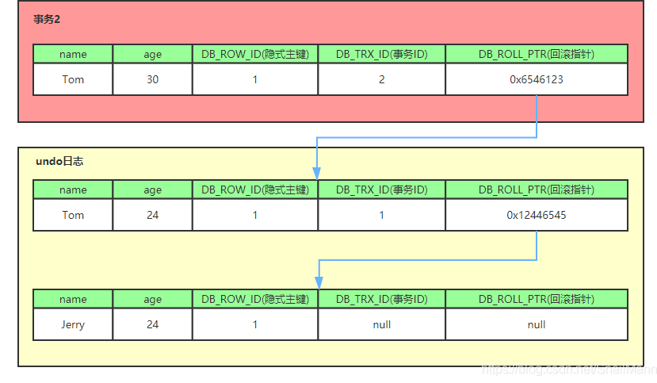

### 所以才有了MVCC

可重复读可以采用纯粹的行锁的方式来实现，但是这种方式是阻塞的，并且阻塞范围广，效率低，所以才有了**MVCC**。

**MVCC**，Multiple Version Concurrency Control，多版本并发控制，能很好地处理读写冲突。（**MVCC**也用到了行锁）

[**MVCC**的实现原理](https://blog.csdn.net/SnailMann/article/details/94724197/)可以分为3部分：隐式字段、Undo Log和Consistent Read View。

### 隐式字段

对一张表来说，除了我们定义的显式字段外，数据库还会自动给我们加上一些隐式字段：

1. **DB_TRX_ID**，6字节，最新生效的事务的ID，也就是多版本中的版本号。
3. **DB_ROLL_PTR**，7字节，回滚指针（pointer，ptr），指向上一个版本，配合Undo Log。
4. **DELETE_BIT**，删除标志位。
4. **DB_ROW_ID**，6字节，自增主键，如果我们不定义主键，数据库就会使用该字段。

**DELETE_BIT**与Purge机制：

1. 事务中的删除操作并不是真的**立刻**将记录删除，而是将记录的标志位**DELETE_BIT**置为真，然后由名为Purge的程统一清理。
2. 并且为了不影响**MVCC**的正常工作，Purge会自己维护一个**快照**。
   1. 该**快照**相当于数据库中**最老**活跃事务的**快照**。
3. 并且**DB_TRX_ID**对Purge是可见的。

### Undo Log的生成过程

1. 事务为<u>当前记录</u>加行锁（**X锁**）。
2. 事务生成一条Undo Log，Undo Log中保存了<u>当前记录</u>的**副本**，和**DB_ROW_ID**、**DB_TRX_ID**、**DB_ROLL_PTR**等隐式字段。

3. 更新<u>当前记录</u>，并将<u>当前记录</u>的**DB_ROLL_PTR**指向该Undo Log，**DB_TRX_ID**存下当前事务的ID。
   1. 如果已经存在其他Undo Log，即**旧日志**，则该Undo Log会被放入这组Undo Log的头部，即，将该Undo Log的**DB_ROLL_PTR**指向这组**旧日志**的头部，并将<u>当前记录</u>的**DB_ROLL_PTR**指向该Undo Log。
   2. 不难看出，原始记录与日志之间是以链表的形式组织的。
   3. 我们其实无法确定**旧日志**是否存在，**旧日志**可能已经被Purge清理。
4. 提交事务，释放行锁。

值得一提的是，Undo Log分为：

1. **Insert Undo Log**
   1. `INSERT`时产生。
   2. 只在事务回滚时需要。
   3. 当前事务提交后就可以丢弃该**Insert Undo Log**。
2. **Update Undo Log**
   1. `UPDATE`和`DELETE`时产生的。
   2. 事务回滚时、快照读时都需要。
   3. Purge会统一清理可以删除的**Update Undo Log**。

### Consistent Read View

一致性视图，也称**快照**，如下图所示，主要有以下内容组成：

2. **m_ids**
   1. 由“生成该**快照**时，处于活跃状态的其他事务的ID”组成的列表。
   2. 活跃的事务，其实就是未提交的事务。
3. **up_limit_id**
   1. 生成该**快照**时，**ids**中最小ID，对应的事务是未提交的事务中最先开始的事务。
4. **low_limit_id**
   1. 生成该**快照**时，**InnoDB**将分配给新事务的ID。
   2. **ids**中的最大值+1就是**max_trx_id**。
   3. 事务ID是按时间递增的。

**MySQL**就是拿<u>当前记录</u>的**DB_TRX_ID**与**快照**中的**m_ids**、**min_trx_id**、**max_trx_id**进行比较，从而判断这条记录对当前事务是否可见。

确切地说，判断过程中会遍历Undo Log链表，查找<u>当前记录</u>中对当前事务可见的版本。

具体过程为：

1. 判断**DB_TRX_ID** < **min_trx_id**，若是，则代表版本于当前**快照**生成前就已提交，故可见；
2. 否则判断**DB_TRX_ID** >= **max_trx_id**，若是，则代表版本虽然已提交，但创建于当前**快照**之后，故不可见；
3. 否则判断**DB_TRX_ID** in **m_ids**，若是，则代表版本在创建当前**快照**时还未提交，故不可见。
4. 否则表示**DB_TRX_ID**与当前事务的ID相同，故可见。

一致性读视图不止用于可重复读，也用于读已提交，其区别在于：

1. 可重复读，仅会在事务开始时生成一个当前事务的全局性**快照**。
2. 读已提交，会在每次执行读取时都会重新生成当前事务的一个**快照**。

所以从**快照**角度来看，可重复读的工作量要比读已提交少。

> 从`UPDATE`角度来看，可重复读的工作量要大。

### [快照读与当前读](https://blog.csdn.net/zcl_love_wx/article/details/83305645)：

1. **Snapshot Read**，快照读，即，根据**快照**中读取数据，不会加锁。
   1. <u>未显式加锁</u>的`SELECT`执行的就是快照读。
2. **Current Read**，当前读，即，直接读取当前**最新**的数据，会逐条加锁。
   1. `INSERT`、`UPDATE`、`DELETE`、<u>显式加锁</u>的`SELECT`执行的是当前读。
   2. 加锁的目的是防止其他事务修改记录。

