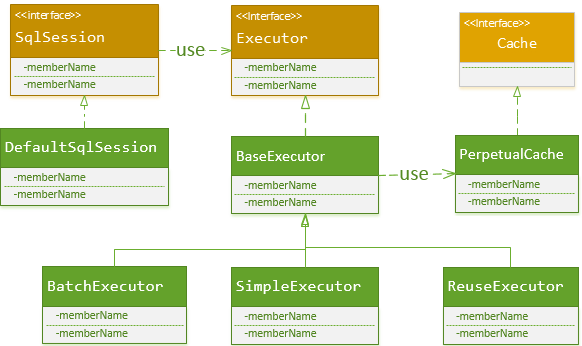
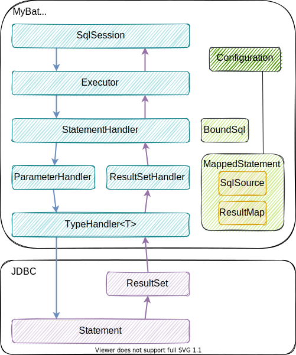

### MyBatis架构图



上图参考自[文章](https://blog.csdn.net/luanlouis/article/details/40422941)。


### 接口层

接口层定义了调用方式。

#### 直接基于SqlSession

1. **SqlSession**接口定义的一系列CURD方法与数据库交互，每个方法都需要传递Statement ID和查询参数。
2. 但是这种方式不符合面向对象的思想，所以便有了基于**Mapper**接口的调用方式。

#### 基于Mapper接口

1. **MyBatis**将一组组的CURD方法抽象为一个个**Mapper**对象，调用指定**Mapper**实例的指定CURD方法就可获取相应的返回结果。
2. 基于**Mapper**接口的调用方式其实是对**SqlSession**的封装：
   1. **MyBatis**基于动态代理通过<span style=background:#b3b3b3>SqlSession.getMapper(XXXMapper.class)</span>创建一个个的**Mapper**实例。
   2. 调用**Mapper**实例的某一方法时，**MyBatis**会根据<u>方法名</u>和<u>参数类型</u>确定Statement ID。
   3. 然后实例化一个**SqlSession**，并调用其相应的CURD方法。
3. 注意，每次通过**Mapper**访问数据库，都会创建一个**SqlSession**，但[同一事务中请求会共用一个**SqlSession**](https://www.jianshu.com/p/5a72006e7779)。


### 数据处理层

数据处理层负责构建SQL（包括参数解析）、执行SQL、封装查询结果。

其中，“封装查询结果”，支持结果集关系一对多和多对一的转换，转换方式支持两种，一种为嵌套查询语句，另一种为嵌套结果集。

一对多查询时，会使用基于CGLib的懒加载。


### 支撑层

#### DataSource

**MyBatis**由三种**DataSource**：

1. Unpooled，不使用**Connection Pool**的**DataSource**。
2. Pooled，使用**Connection Pool**的**DataSource**。
3. JNDI，使用JNDI实现的**DataSource**。

**MyBatis**使用工厂模式创建**DataSource**。

创建SqlSession执行SQL时，**MyBatis**才会调用**DataSource**来实例化<span style=background:#b3b3b3>java.sql.Connection</span>。

#### Connection Pool

每次执行SQL都创建**Connection**是浪费的，而将**Connection**池化是一个很好的选择。

**MyBatis**的**Connection Pool**中的**Connection**有两种空闲（Idle）和活动（Active）两种状态，且两种状态的**Connection**会分别放置在IdleConnections和ActiveConnections中。

当从**Connection Pool**中获取**Connection**时：

1. 若IdleConnections不为空，则直接返回一个**Connection**；
2. 若IdleConnections为空，但ActiveConnections未满，则会返回一个新的**Connection**；
3. 若IdleConnections为空，且ActiveConnections满，会查看最先放入ActiveConnections中的连接是否过期，如果过期，则移除该Connection，并新建一个Connection；
4. 否则，返回第二步。

使用完的**Connection**会被调用close()，但是该方法经过了代理，不会释放资源，而是将**Connection**放入IdleConnections中。

> 上面提到的Connection实际上是MyBaits对<span style=background:#b3b3b3>java.sql.Connection</span>的代理类，即使用了<u>代理模式</u>。

<span style=background:#ffee7c>连接数问题</span>

#### 事务

**MyBatis**提供了两种事务管理方式：

1. JdbcTransaction，使用<span style=background:#b3b3b3>java.sql.Connection</span>来管理事务（GetConnection、Commit、Rollback、Close）。
   1. 开启“auto commit”后，会忽略Commit和Rollback。
2. ManagedTransaction，将事务管理托管给JBoss、WebLogic等容器。
3. 在事务中调用**Mapper**的方法时，会增加引用次数，调用完成，就减少引用次数，不会真正关闭**SqlSession**；[但如果会话不存在事务](https://segmentfault.com/a/1190000015138959)，则直接关闭**SqlSession**。

> MyBatis使用了<u>工厂模式</u>来创建事务。

#### 缓存

**MyBatis**提供两级缓存：

1. 会话级别
   1. 该缓存位于Executor中，而**SqlSession**又持有Executor中，查询结果会存入该缓存。
   
      
   
   2. **SqlSession**中的任何<span style=background:#c2e2ff>修改</span>操作都会<span style=background:#c2e2ff>清空</span>该缓存。
   
   3. 该缓存实际上是一个HashMap实例，由Statement ID、传入参数、rowBounds（limit、offset）组成Key，也没有额外的到期失效机制。
   
2. 应用级别

   1. 该缓存的生命周期与应用相同。
   
   2. 开启该缓存后，**MyBatis**会在为**SqlSession**创建**Executor**时，对**Executor**对象加上一个装饰者**CachingExecutor**，之后的实际请求都会经过**CachingExecutor**，而**CachingExecutor**会将结果缓存。
   
      > **CachingExecutor**的设计体现了<u>装饰者模式</u>。
      
   3. 该缓存有两种使用方式：\<cache/\>，每个**Mapper**独享一个缓存；\<cache-ref/\>，多个**Mapper**共用一个缓存。
   
   4. 该缓存支持如**LRU**、**FIFO**等多种缓存刷新策略，还支持自定义策略，集成**Redis**。

### 引导层

实例化配置类，实例化SqlSessionFactory。

> 实例化SqlSessionFactory时使用了<u>Builder模式</u>。


### MyBatis核心类

#### 核心类及其功能

| 核心类           | 功能                                                         |
| ---------------- | ------------------------------------------------------------ |
| SqlSession       | 会话，与数据库交互的入口                                     |
| Executor         | 执行器，负责生成SQL和维护查询缓存                            |
| StatementHandler | 对JDBC Statement的封装，负责对设置JDBC Statement的参数、将JDBC Statement结果集转换成集合 |
| ParameterHandler | 将传入SqlSession的参数转换成JDBC Statement 所需要的参数      |
| ResultSetHandler | 将JDBC返回的ResultSet转换成集合                              |
| TypeHandler      | Java数据类型和JDBC数据类型相互映射、转换                     |
| MappedStatement  | 对CURD的封装                                                 |
| SqlSource        | 根据传入的ParameterObject，动态生成SQL，封装为BoundSql对象并返回 |
| BoundSql         | 动态生成的SQL以及相应的参数信息                              |
| Configuration    | 配置类                                                       |

#### 核心类之间的关系




### 使用

#### 占位符模糊查询

1. <span style=background:#b3b3b3>"%"#{question}"%"</span>：<span style=background:#b3b3b3>#{…}</span>解析成SQL时，会在变量外侧自动加<u>单引号</u>，所以这里`%`需要使用<u>双引号</u>，不然，如果使用单引号会查不到任何结果。

2. <span style=background:#b3b3b3>CONCAT(’%’,#{question},’%’) </span>使用`CONCAT()`来拼装SQL。

3. 使用\<bind/\>标签。

   ```xml
   <select id="listUserLikeUsername" resultType="com.jourwon.pojo.User">
   　　<bind name="pattern" value="'%' + username + '%'" />
   　　SELECT id,sex,age,username,password FROM person WHERE username LIKE #{pattern}
   </select>
   ```

   
