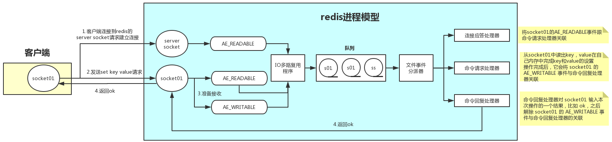

### 进程模型

**Redis**服务端采用**NIO**，其进程模型采用多路复用模型中**Reactor**模型，**Reactor**模型主要分为2部分：

1. 事件
   1. 多路复用模型由事件驱动，**Redis**定义了多种事件即相应的事件处理器。
      1. 事件处理器包括：连接应答器，命令请求处理器，命令回复处理器。
2. **Selector**，事件分发器
   1. **Redis**将**Selector**细分为IO多路复用程序和文件事件分派器，并在“IO多路复用程序”和文件事件分派器之间引入了**队列**来增强多路复用。
      1. IO多路复用程序负责监听多个**Socket**，将各个**Socket**产生的事件放入**队列**中。
      2. 文件事件分派器会将**队列**中的事件分派给不同的事件处理器处理。

> 所谓的多路复用就是用一个线程监听多个套接字，而非一个线程监听一个套接字。
>
> 多路复用是通过调用select、epoll、evport、kqueue等[IO多路复用函数库](https://juejin.cn/post/6844903954917097486#heading-5)来实现的。
>
> File Event Handler，也叫做Dispatcher，结合两者，我们将其译为文件事件分派器。

### 处理过程

1. 连接的建立：

   1. **Redis**客户端向服务端请求建立**Socket**，服务端中的IO多路复用程序将请求封装为AE_READABLE事件，并压入队列。
   2. 文件事件分派器从队列中取出AE_READABLE事件并将其分派给连接应答器。
   3. 连接应答器与客户端建立连接，并将该连接的AE_READABLE事件与命令请求处理器关联。

2. 命令的执行

   1. 建立连接后的客户端向服务端发送请求，以执行键值对的处理命令，服务端中的IO多路复用程序将请求封装为AE_READABLE事件，放入队列。
   2. 分派器从队列中取出AE_READABLE事件，由于该连接已经与命令请求处理器相关联，所以事件会分派给命令请求处理器。
   3. 命令请求处理器收到事件后，会从事件中取出（我猜的）键值对处理命令并执行，执行完毕后，会将该连接的AE_WRITABLE事件与命令回复处理器关联。

3. 结束通信

   1. 当客户端准备好接收返回结果时，也会向服务端发送请求，服务端中的IO多路复用程序将请求封装为AE_WRITABLE事件，并压入队列。
   2. 分派器从队列中取出AE_WRITABLE事件，由于该连接已经与命令回复处理器相关联，所以事件会分派给命令回复处理器。
   3. 命令回复处理器将键值对的处理结果返回给客户端，并解除该连接的AE_WRITABLE事件与命令回复处理器的关联。

7. 此外还有AE_NONE事件，表示该连接没有任何事件。

### [与多线程](https://www.cnblogs.com/gz666666/p/12901507.html)

一般来说，**Redis**的瓶颈不在于CPU，而在于内存和网络。

1. CPU

   1. 由于CPU压力较小，我们可以通过在一台机器上部署多个**Redis**实例来提升对多处理器、多核心的利用率。
   2. 这种多实例的思想与多线程的思想相仿，利用并发来提升对机器资源的利用率。

3. 内存不足其实很容易解决，对硬件进行扩容就行。

3. **Redis**在6.0版本引入了多线程来提升网络IO，。
   1. **Redis**的多线程仅限并发写、并发读，而不支持并发的既读又写，其核心仍旧为单线程。
   2. 其实在4.0版本，**Redis**就引入了多线程来提升删除速度。

