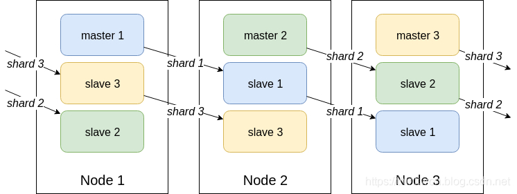

### 客户端分配

**Redis**的分布式结构在最开始时，服务端由多个实例组成，但实例之间毫无联系，由客户端将key散列到相应实例（节点）上。

服务端很容易扩展，但每个客户端需要重新调整散列方法，并且数据的备份也会变得复杂。

在此基础上出现了代理服务器，所有的客户端通过代理服务器来访问服务端，由key散列也交由代理负责，但显然性能会有所损耗。

### 主从结构

另一种服务端结构是一主多从的结构，即主节点只负责数据的写入，其他从属节点提供副本的读取，实现了读写的分离，适合读多写少的场景。由于副本的复制是异步的，故存在延迟，而且，所有的读写分离的方案都会增加系统的复杂度。

主从节点复制的过程：

1. 当从属节点与主节点建立连接后，从属节点会向主节点发同步数据的请求。
2.  当主节点收到请求后，会在后台生成一个rdb格式的快照文件，同时会缓存这期间收到的写命令。
3. 待快照完成后，主节点会将快照和写命令缓存一并发送给从节点。
4. 从属节点收到命令后会加载快照并执行缓存中的写命令。
5. 之后，每当主节点收到写命令，都会转发给从节点。

使用主从结构时，需要开启主节点的持久化功能，以防止主节点故障重启后没有日志可读从而缓存为空，进而会导致从属节点同步后会将空缓存同步。

而副本的复制最好以链式进行，而非树式进行，以降低主节点的压力。

### Redis Sentinel

哨兵负责监视**Redis**（主从）节点的状态，以及主节点的选举分配。

哨兵也是分布式的，需要至少3个节点才能保证可用性。

**Redis**的主从结构，与**MySQL**的主从类似，称不上真正的集群，而真正的**Redis Cluster**是这样的：

   

### 集群

**Redis Cluster**没有采用一致性散列，而是采用slot（槽）的概念，共分为16384（2^14）个槽，这些槽会均分给每个节点，数据的key使用算法校验后对2^14次方取余，来决定放入哪个槽中。

而槽的设定也限制了集群最多有2^14个节点。

请求可以发给集群中的任意节点，节点会将请求转发给正确的节点处理。

集群扩容时需要迁移部分旧数据到新节点中。

**Redis Cluster**有以下特点：

1. 无中心架构，客户端连接集群中的任意节点即可。
2. 支持自动扩容，故障转移。
3. 客户端直连集群，无代理，也就无损耗。

但也有以下不足：

1. 运维复杂，数据迁移需要人工干预（这么弱智？）
2. 功能受限，只能使用0号数据库，且不支持pipeline（批量）操作。
3. 分布式逻辑和存储模块耦合。

### RedLock

**RedLock**是官方提供的分布式锁，具有互斥、避免死锁、良好的容错特性。

### 分布式锁

**Redis**可以作为分布式锁。

客户端通过向服务端发送**SETNX**（**SET** if **N**ot e**X**ists）命令获取锁，使用**DEL**命令释放（删除）锁。

最好为锁设置过期时间，防止持有锁的应用挂掉时未能释放锁（那这样还得增加心跳检测，防止锁被异常释放）。

单机**Redis**可以提供分布式锁，因为它独立于分布式系统。

**Redis**集群无法提供分布式锁，存在脑裂问题。

但是**RedLock**可以缓解这一状况，只不过无法保证在极端情况下的准确性。