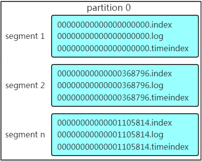
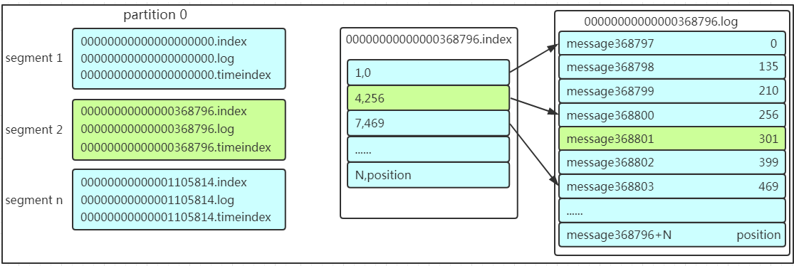

## 消息队列

消息队列有2个主要作用： 解耦和异步。

> 异步会进一步发挥缓冲、削峰等作用。

消息队列有点对点、订阅/发布两种模式。

## 关于数据结构

##### Partition，分区

1. 一个**Topic**可以切分为多个**Partition**，每个**Partition**在硬盘上对应的是一个的文件夹，在这个文件夹中存储着多组**Segment**。

2. 每个**Partition**内的**Message**都是有序的，但是**Partition**间的**Message**显然是无序的。

   > **Kafka**使用追加写的方式，并发读写不会相互阻塞。

3. **Kafka**按照如下规则均衡**Message**在**Partition**上的分布：
   1. 如果**Message**指定了**Partition**，则写入指定**Partition**。
   2. 如果**Message**没有指定**Partition**，但设置了Key，则会根据Key散列到相应的**Partition**。
   3. 如果**Message**没有指定**Partition**，也未设置Key，则会轮询选出一个**Partition**。

4. 新加入**Partition**时不会进行数据迁移，但会参与以后的负载均衡。

   > 负载均衡在早期版本中使用**Zookeeper**维护；后期改为Metadata API。

##### Replication

1. **Partition**其实分为2种：**Primary Partition**和**Replicative Partition**。
2. **Replicative Partition**简称**Replication**。
3. 每个**Primary Partition**可以有多个**Replication**，用于容灾，**Replication**的数量不大于**Broker**的数量。

> **Partition**和**Replication**的分配规则为：
>
> 1. 将**Broker**（size = n）和待分配的**Partition**排序。
> 2. 将第 i 个**Partition**分配到第 i % n 个**Broker**上。
> 3. 将第 i 个**Partition**的第第 j 个**Replication**分配到第 (i + j) % n 个**Broker**上。
>
> **Partition**用于水平扩展，**Replication**用于容灾。

##### Segment

1. 如[下图](https://www.cnblogs.com/sujing/p/10960832.html)所示，**Segment**是一个逻辑概念，**Partition**是由若干个**Segment**组成。
2. **Segment**按**Offset**有序排列。
3. **Segment**由3种相同名称的文件组成，包括2种索引文件（\*.index、\*.timeindex）和1个日志文件（\*.log）组成。
   1. 索引文件用于检索**Message**，而日志文件用于保存**Message**。
   2. **Kafka**采用稀疏索引（索引值不连续），而非全量索引，以减少索引文件大小。

##### Message

1. **Message**的存储策略有基于时间、基于大小两种。

   > 删除旧数据不会提升**Kafka**的传输效率，只是释放了磁盘空间。

2. **Message**由以下属性组成：

   1. 8 byte offset，偏移量，有序ID。
   2. 4 byte message size，消息大小。
   3. 4 byte CRC32，用于校验（校验不通过的消息会被直接丢弃）。
   4. 1 byte magic，协议版本号。
   5. 1 byte attributes，独立版本、标识压缩类型、编码类型。
   6. K byte key，可选。
   7. 4 byte key length，Key的长度；当length为 -1 时，Key可不填。
   8. 4 byte payload length，消息体大小。
   9. payload，消息体。

## 关于角色

##### Broker

1. 代理服务器，也就是消息队列。

2. **Broker**根据持有的**Partition**的主副类型，分为**Leader**、**Follower**2种角色：

   1. 拥有**Primary Partition**的**Broker**称为该**Partition**的**Leader**。
   2. 拥有**Replication**的**Broker**称为该**Partition**的**Follower**。
   3. 整个**Broker**集群是无主的，**Leader**、**Follower**仅针对**Partition**而言。

3. **Message**只会发送给**Leader**，而**Follower**通过开启一个**Consumer**线程的方式进行消息同步。

4. 选举：

   1. **Broker**通过在**Zookeeper**中抢注临时节点的方式选出一个**Controller**。

   2. **Controller**会Watch其他的**Broker**，当发现有**Broker** / **Leader**宕机时，会从**ISR**中选择一个**Broker**作为**Leader**。

      > ISR，In-Sync Replica，可靠从属节点列表。通过配置“列表最小数量”（min.insync.replicas）来开启。

   3. 如果**ISR**中的**Broker**都宕机，或者**ISR**未开启，**Kafka**会选择一个幸存的**Broker**作为**Leader**。

   4. 如果没有**Broker**幸存，**Kafka**会将第一个恢复的**Broker**作为**Leader**。

   5. 如果该**Broker**不在**ISR**中的，**Kafka**会将其标记，待**ISR**中的任一**Broker**恢复后，将**ISR**中的**Broker**设为**Leader**。

5. 当**Broker**的同步进度落后太多或发生超时，**Leader**会将这个**Broker**移出**ISR**；当这个**Broker**恢复后（进度已经追回、及时响应），**Leader**不会自动将其加入**ISR**，需要人工手动添加。

6. 任一**Broker**都可以向**Producer**提供包含“存活的**Broker**列表”、“**Partition Leader**列表”等Metadata，**Producer**会根据这些Metadata与**Topic**中的所有**Partition Leader**保持连接，并将**Message**直接通过**Socket**发送给对应的**Broker**，中间不会经过任何“路由层”。

##### Producer

1. 生产**Message**，推送到消息队列。

##### Consumer

1. **Kafka**采用**Pull**的方式消费。

   > Push方式可以保证消息的及时性，但是如果**Consumer**消化不良，就可能把**Consumer**给撑死。
   >
   > Pull方式中，Pull频率一提高，**Broker**的压力就会增大。

2. **Consumer**有2套API可选：
   1. Sample-API
      1. 维持和单一**Broker**的无状态连接，每次请求都需要指定**Offset**，比较灵活。
   2. High-Level API
      1. 封装了对整个集群的连接，并维护自己**Offset**。
         1. 早期版本中使用**Zookeeper**维护。
         2. 后期版本，**Consumer**会用\_\_consumer_offsets主题维护自己的**Offset**：以包含**Consumer Group**、**Topic**、**Partition**的三元组作为Key，直接提交到compacted topic中。
      2. 支持**Consumer Group**。

##### Consumer Group，消费者组

1. 多个**Consumer**可以组成一个消费者组：
   1. 组内的**Consumer**数量小于**Partition**数量时，**Consumer**会读取不同的**Partition**，会有多余开销。
   2. 组内的**Consumer**数量等于**Partition**数量时，一个**Consumer**只会专注消费一个**Partition**。
      1. 此时如果**Producer**通过Key将**Message**发送到指定的**Partition**，就能做到顺序消费。
   3. 组内的**Consumer**数量大于**Partition**数量时，多出来的**Consumer**不会工作。

提到**Zookeeper**：

1. **Producer**使用**Zookeeper**来发现Broker，以便和**Topic**下每个**Partition Leader**建立连接。
2. **Broker**使用**Zookeeper**来注册自己，以及监测**Partition Leader**。
3. **Consumer**使用**Zookeeper**来注册自己，包括自己订阅的**Topic**、消费的**Partition**列表等，以便在**Consumer Group**、**Broker**、**Partition**发生变化时进行**Rebalance**；同时也用**Zookeeper**来发现**Broker**，并和**Partition Leader**建立连接。
4. **Consumer Group**使用**Zookeeper**保存每个**Partition**的**Consumer**的ID和**Offset**。
5. **Controller**会通过**Zookeeper**将选举结果通知其他的**Broker**。

## 消息读取过程

**Broker**查找**Message**的过程如[上图](https://www.cnblogs.com/sujing/p/10960832.html)所示：

1. 根据“逻辑**Offset**”从**Partition**中<u>确定**Segment**</u>。

2. 在该**Segment**对应的xxx.index中根据“相对**Offset**”找到**Message**的“物理**Offset**”。

   > “相对**Offset**” = “逻辑**Offset**” - “起始**Offset**”
   >
   > 而“起始**Offset**”就是**Segment**的编号。

3. 根据物理**Offset**到xxx.log中直接定位到**Message**，然后读取。

<u>确定**Segment**</u>和查找<u>相对**Offset**</u>的过程都会采用二分查找。

\*.timeindex有什么作用？

