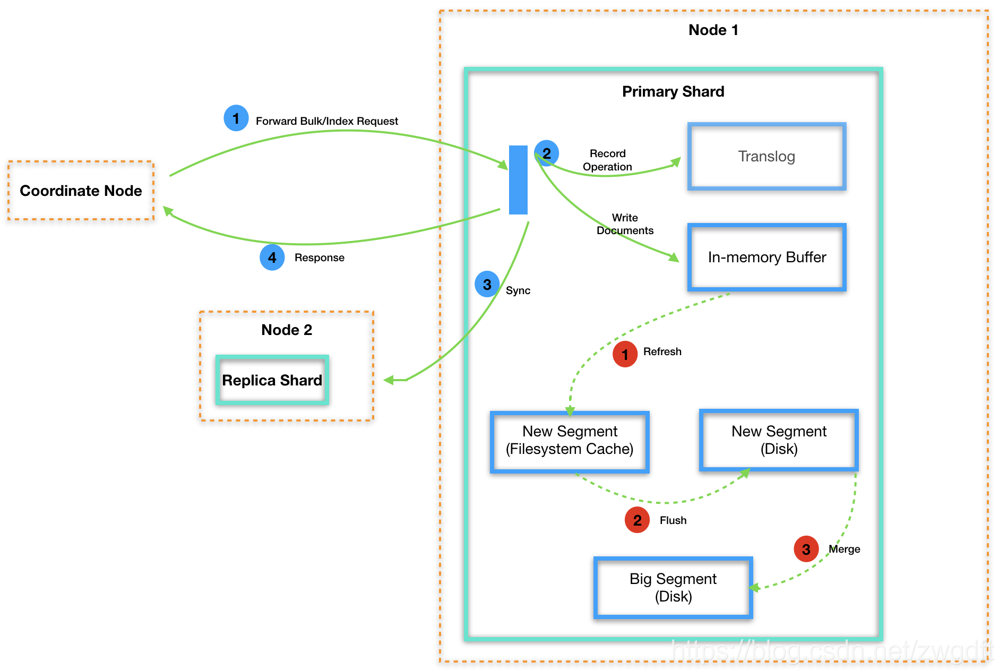
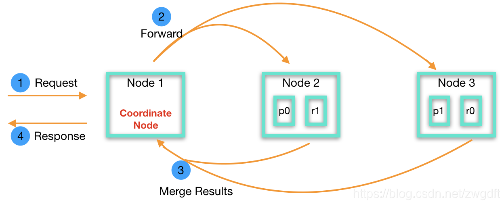

## 简介

**Elasticsearch**是一个分布式全文搜索引擎。

它基于**Lucene**开发，我们没有必要可以区分两者，除非有研究源码，或深入了解**Solr**与**Elasticsearch**的需要。


## [基本概念](https://www.cnblogs.com/duanxz/p/10108296.html)

1. ##### NRT，Nearly Real Time

   1. **Elasticsearch**是一个近实时系统，写入**Elasticsearch**的数据不会立即生效，需等待<span style=background:#e6e6e6>每秒1次</span>的<span style=background:#c2e2ff>refresh</span>后才会生效被查询到。
   2. 同时对于已生效数据，**Elasticsearch**能以秒级速度响应返回结果。

2. ##### Cluster，集群与中心化

   1. 从集群外部来看，也就是以Client的角度来看，**Elasticsearch**的集群是去中心化的，因为集群是作为一个整体对外提供服务的，从任何节点操作数据得到的结果都是一致的。
   2. 但是从集群内部来看，仍然需要有主节点这种角色来管理集群。

3. ##### Node

   1. 节点，即一个**Elasticsearch**实例。
   2. 集群中的节点都拥有相同的集群名称（<span style=background:#e6e6e6>cluster.name</span>）。

4. ##### Document

   1. 文档，几乎等同于RDBMS中的一行记录，或者Java中的Bean；不同的是，**Document**仅是最顶层结构或者根对象序列化成的JSON对象。
   2. **Document**使用JSON存储，结构多样，但是同一**Index**中的**Document**尽量结构一致，这样你好我好大家好。

5. ##### Index

   1. 索引，具有相同结构的**Document**的集合。
   2. 比起RDBMS中的<span style=background:#c2e2ff>数据库实例</span>的概念，**Index**更接近RDBMS中<span style=background:#f8d2ff>Table</span>的概念（6.0版本之后更是如此）。
   3. **Elasticsearch**的**Index**是按照字段进行划分的。

6. ##### Shard

   1. “分布式存储系统”都会将一个<span style=background:#f8d2ff>Table</span>分成若干部分，也就是一个个的分片，并将这些**Shard**均匀的分布到不同的**Node**上，以达到并行计算的目的。
   3. 一个**Index**在创建时就需要指定**Shard**的数量，默认<span style=background:#e6e6e6>5片</span>，**Index**创建后，**Shard**数量无法修改。
   4. 而**Shard**与**Node**的对应关系不是一成不变的，当有“Data Node”加入、退出集群时，“主节点”就会将这些**Shard**重新分配给“Data Node”，即<span style=background:#c2e2ff>Relocate</span>，所以**Shard**的体积不宜过大，<span style=background:#e6e6e6>50GB</span>以内（也有说<span style=background:#e6e6e6>30GB</span>的）。
   5. **Shard**是以**Segment**为单位来组织数据。而**Segment**是<span style=background:#ff8000>不可修改的</span>，这就使得**Elasticsearch**免去了对读写操作的<span style=background:#c2e2ff>加锁</span>。
   6. 一个**Shard**就是一个完整的**Lucene**实例，提供完整的检索功能。
   
7. ##### Replica

   2. **Elasticsearch**的**Shard**其实有两种类型：Primary Shard、Replication Shard（**Replica**），**Replica**的内容与Primary Shard的内容完全一致（由同步机制保持一致）。
   3. 一片Primary Shard默认有<span style=background:#e6e6e6>1片</span>**Replica**。
   4. “分布式存储系统”都会有副本机制，以满足容灾的要求。
   5. **Replica**也是可用于搜索的，确切的说是用于<span style=background:#d4fe7f>负载均衡</span>，从而提升集群整体的计算能力。

8. ##### Mapping

   1. 表结构。
   2. **Elasticsearch**是"Schema Free"的，即，允许我们不指定**Mapping**，**Elasticsearch**会使用默认值，并自动推导字段的类型。
   3. 但是这种灵活性开发者往往把握不住，造成数据结构混乱，失去对数据的控制，并且自动推导出来的类型可能不是预期的，会导致写入和查询的问题。所以尽量指定**Mapping**。

9. ##### Type

   1. **Document**的细分类型。
   2. 在低版本的**Elasticsearch**中，<span style=background:#ffb8b8>Index</span>可以类比RDBMS中的<span style=background:#ffb8b8>数据库实例</span>，<span style=background:#f8d2ff>Type</span>可以类比RDBMS中的<span style=background:#f8d2ff>Table</span>，<span style=background:#c9ccff>Mapping</span>可以类比<span style=background:#c9ccff>Schema</span>。
   3. 但是RDBMS中每张<span style=background:#f8d2ff>Table</span>拥有自己的<span style=background:#c9ccff>Schema</span>，并且每个<span style=background:#c9ccff>Schema</span>独立存储；但**Elasticsearch**不同，同一<span style=background:#ffb8b8>Index</span>中的<span style=background:#f8d2ff>Type</span>共用一个映射<span style=background:#c9ccff>Mapping</span>，即不同<span style=background:#f8d2ff>Type</span>中相同名称的字段就是同一个字段。
   4. 并且在一种<span style=background:#ffb8b8>Index</span>中很少需要再细分<span style=background:#f8d2ff>Type</span>，或者说两种<span style=background:#f8d2ff>Type</span>的数据很少放入同一<span style=background:#ffb8b8>Index</span>，即便这两类数据关系密切。比如，商品的订单和评论，很少有人会将其放入同一张索引（表）中，并且多<span style=background:#f8d2ff>Type</span>导致了存储**稀疏不均**，严重影响了**Lucene**的压缩能力。
   5. “细分类型”这一设计在使用上很不方便，也正因此**Elasticsearch 6.0**后开始淡化<span style=background:#f8d2ff>Type</span>的概念，只允许一个<span style=background:#ffb8b8>Index</span>拥有一个<span style=background:#f8d2ff>Type</span>。

10. ##### Alias

    1. 别名，**Index**的别名，类似与RDBMS的视图、Linux的软链接。
    2. 我们可以为多个不同的**Index**设置相同的**Alias**，从而达到<span style=background:#c2e2ff>汇集</span>多个**Index**的效果。
    3. 同时**Alias**允许我们随意修改，只要不与现有**Index**同名，这种设计允许我们通过同一个**Alias**达到在不同**Index**上<span style=background:#c2e2ff>切换</span>的效果。
    4. 还可以为**Index**的<span style=background:#c2e2ff>子集</span>设置**Alias**。
    5. **Alias**还提供了原子操作[\_aliases](https://www.elastic.co/guide/cn/elasticsearch/guide/current/index-aliases.html)，方便我们进行”零停机数据迁移“。
    6. 更多关于别名的操作，详见[文章](https://www.cnblogs.com/duanxz/archive/2013/05/11/3072547.html)

11. ##### Gateway

    1. 持久化方式：默认为持久化到本地文件，也可以选择HDFS。

12. ##### Zen Discovery

    1. 同网段自动发现机制：节点上线时会在网络中<span style=background:#c2e2ff>广播</span>以寻找并加入到已存在的相同<span style=background:#e6e6e6>cluster.name</span>的集群，同时也支持预先指定节点IP。

13. ##### Cluster Health

    1. 集群健康度：一个比较重要的监控统计信息，有Green、Yellow、Red等3种值。 


## 角色

**Elasticsearch**集群中的节点存在5种角色：

1. ##### Master-eligible Node

   1. 候选主节点：集群会从中选举出主节点，也叫做**Candidate**。

   2. 主节点管理数据（创建、删除索引，分配分片），以及追踪节点状态，该角色对机器配置要求较低。

   3. ```properties
      #配置为：
      node.master=true
      node.data=false
      ```

2. ##### Data Node

   1. 数据节点：负责数据的存储查询聚合等，是负载最重的角色。

   2. ```properties
      #配置为：
      node.master=false
      node.data=true
      ```
   
3. ##### Coordinate Node

   1. 用于协调请求的分发以及结果的合并。

   2. 在实际使用时，可以单独增设这类角色，减轻“Data Node”的负担。

   3. 前文提到，Client可以向集群中的任意节点发送请求，当节点收到请求后，就会成为“Coordinate Node”。

   4. ```properties
      #配置为：
      node.master=false
      node.data=false
      ```
   
4. ##### Ingest Node

   1. 这种角色的节点负责在数据写入前，对数据进行转换处理，该角色使用频率不高。
   2. 以上4种角色可以随意搭配，但是在实际使用时，往往都是一个节点只设置一种角色。

5. ##### Tribe Node

   1. 部落节点：横跨多个集群，收集集群的状态信息，将集群组合成一个更大的整体。
   2. <span style=background:#b3b3b3>**Elasticsearch 7.0**后废除</span>。

**Elasticsearch**[使用**Bully**进行选举](https://zhuanlan.zhihu.com/p/110079342)，投票时，会先比较<span style=background:#e6e6e6>cluster.state.version</span>，如果<span style=background:#e6e6e6>cluster.state.version</span>相同，再比较<span style=background:#e6e6e6>node.id</span>。

> **Elasticsearch 7.0**参照**Raft**对选举进行了调整。

**Master**会向各个**Node**发送的集群状态，<span style=background:#e6e6e6>cluster.state.version</span>就是这个状态的版本号。当集群状态发生了变化，如新增了**Node**或者**Node**退出了，那么<span style=background:#e6e6e6>cluster.state.version</span>就会加一。

**Master**会主动降级：

1. 当发现自己能连接的**Slave**小于半数时，会自动降级为**Candidate**。
2. 当发现集群中存在其它**Master**，且自己的<span style=background:#e6e6e6>cluster.state.version</span>小于对方时，会自动降级为**Candidate**。

任一节点发现**Master**没有得到半数以上节点认可的时候，就会触发选举。


## 读写过程

### 写入过程

**Document**的[写入过程](https://blog.csdn.net/zwgdft/article/details/83619905)为：

1. **Elasticsearch**收到写入**Document**的请求后，会根据**Document**的Key来确定**Document**该分配到哪片**Shard**上。
   1. 计算方法为，先求该Key的<u>散列值</u>，然后将<u>散列值</u>模除<u>分片数</u>得到余数，该余数就是**Shard**的编号。
   
2. **Elasticsearch**也采用了**WAL**（预写式日志）机制，当**Shard**所在的**Node**收到该**Document**后会先写**TransLog**。
   1. **TransLog**也被用来作实时CURD。
   2. `index`、`delete`、`update`、`bulk`等操作，每次都会将自己产生的**TransLog**执行<span style=background:#b3b3b3>fsync()</span>，而其他操作<span style=background:#e6e6e6>每5秒</span>才对**TransLog**执行一次<span style=background:#b3b3b3>fsync()</span>。
   
3. 待日志写完后，

   1. **Node**将**Document**写入内存缓冲区。
      1. 此时**Document**<span style=background:#ff8000>没有</span>生效，查询不到，需等待每秒1次的<span style=background:#c2e2ff>refresh</span>，将缓冲区的文档封装成**Segment**写入到<span style=background:#c9ccff>OS Cache</span>中。
      2. **Elasticsearch**会周期性地对<span style=background:#c9ccff>OS Cache</span>中的数据执行<span style=background:#b3b3b3>fsync()</span>，完成数据的持久化，**TransLog**也就失效待清理。
      3. 不难想象随着时间的推移，会产生大量小**Segment**，导致性能下降，所以**Elasticsearch**会周期性地对**segment**进行<span style=background:#c2e2ff>合并</span>整理。

   2. 同时将**Document**同步给其他**Replica**。

7. 待完成写入<span style=background:#c9ccff>OS Cache</span>、同步副本后，**Node**将结果返回给Client。



### 读取过程

**Document**的查询过程分为：

1. [Query](https://www.elastic.co/guide/cn/elasticsearch/guide/current/_query_phase.html)
   1. Client向集群中的某一**Node**发送请求，而收到请求的**Node**就会自动担任“Coordinate Node”，进行Query和Fetch。
   2. “Coordinate Node”会在本地创建<u><span style=background:#e6e6e6>from+size</span>大小的有序队列</u>，然后将请求广播给所有拥有该**Index**的**Shard**（无论Primary Shard还是Replica）的“Data Node”，当然这些“Data Node”可能包含该“Coordinate Node”。
   3. “Data Node”收到广播后，检索**Shard**，每个**Shard**都会在本地创建<u><span style=background:#e6e6e6>from+size</span>大小的有序队列</u>，将结果填入队列中，这个队列<span style=background:#ff8000>仅</span>包含<span style=background:#e6e6e6>Document.ID</span>和<u>排序用的分数</u>。

      > 一个**Shard**会用一个线程来查询，也就是说，**Shard**越多，线程数就越多，并发量就越大；但是，分片数 / 线程数不是越多越好，过多的线程数反而会带来<u>过多的句柄</u>、<u>过多的排队</u>以及<u>资源的消耗</u>，反而降低性能（不一定比较少数量的较大分片更快）。
      >
      > **Elasticsearch**使用[词频统计来计算分数（相关性）](https://www.elastic.co/guide/en/elasticsearch/guide/current/relevance-intro.html)。

   4. “Data Node”将各个**Shard**的队列返回给“Coordinate Node”，“Coordinate Node”将这些队列合并、排序、分页，最终添加到自己的<u>有序队列</u>中。

      > 我推测，最终队列中只有size个文档，from之前的都会丢弃，不会进入Fetch阶段，更不会返回给客户端。
2. [Fetch](https://www.elastic.co/guide/cn/elasticsearch/guide/current/_fetch_phase.html)
   1. “Coordinate Node”从刚才生成的<u>有序队列</u>中按照<span style=background:#e6e6e6>Document.ID</span>，再去各个“Data Node”上Fetch（拉取）实际的文档内容（_source）。
   2. 如有需要，还会再拉取后根据元数据丰富结果、高亮搜索片段。

   3. 根据<span style=background:#e6e6e6>from+size</span>，将不需要的结果丢弃，即分页，最后将结果返回给Client。


之后每次请求中的Query，“Coordinate Node”不再广播，而是采用轮询”Primary Shard“和”Replica“的方式，以<span style=background:#d4fe7f>负载均衡</span>。




## 分页

不难发现，受读取原理的决定，**Elasticsearch**的深分页功能支持的不好，通常<span style=background:#e6e6e6>10K~50K条</span>，也就是<span style=background:#e6e6e6>1k~5k页</span>的深分页是可行的，超过这个范围的分页会使排序过程变得非常繁重，且开销巨大。

如果是下拉加载（刷微博）这种分页，而非输入指定页号然后跳转，那么可以使用“Scroll API”。

> “Scroll API”会一次性为符合条件的所有数据生成一个快照，然后通过每次移动游标`scroll_id`来实现翻页。“Scroll API”翻页的响应时间是毫秒级的，要比直接分页快很多。
>
> 生成一个快照时须指定`scroll`参数，并指定快照的失效时间。

除了使用“Scroll API”，还可以使用“search_after”来实现翻页。

> “search_after”会使用前一页的结果来辅助下一页的检索。
>
> 这种方式也不允许跳页。
>
> 初始化时，需要使用一个唯一值的字段作为`Sort`的字段。

同时，大批量获取数据时，往往会设置搜索类型为scan来禁用排序。


## 热点问题

### 读写

**Elasticsearch**能很好地应对读操作的<span style=background:#ffb8b8>热点问题</span>，因为**Elasticsearch**是一个以读（检索）为主的系统，<span style=background:#ffb8b8>热点数据</span>往往在内存中都会有缓存，会很快的返回给客户端，读操作一般不会成为系统瓶颈，如果成为瓶颈，我们可以采用增加节点，以及横切竖切的方式应对。

关于写操作的<span style=background:#ffb8b8>热点问题</span>，因为写入发生在硬盘，<u>写硬盘</u>显然要比<u>读内存</u>漫长地多，容易成为系统瓶颈，可增加**Node**分散压力，用空间换时间。

### 横切竖切

横切指的是“精简字段”，竖切的指的是“冷热数据分离”，两者的最终目的，是将尽可能将一半以上，甚至全部的搜索用的<span style=background:#ffb8b8>热点数据</span>装入内存，这样能大大提升查询速度。

> 当然也可以采用SSD这种这种的方案，但前提也是横切竖切。

同时可采用**Elastisearch** + **HBase** 的组合，即，查出<span style=background:#e6e6e6>Document.ID</span>后，去**HBase**中获取**Document**的详细数据。因为**HBase**十分适合海量数据的实时存储，但不擅长复杂的搜索。

> 很难说“**Elastisearch**开启`_source`，自动保存原文”的方式，和“**Elastisearch**关闭`_source`，由 + **HBase**保存原文”的方式，孰优孰劣。
>
> “**HBase**返回原文”的方式多了一层业务逻辑，对查询速度有影响，但至少节省了**Elastisearch**机器的磁盘空间，如果**Elastisearch**机器采用SSD，这或许有意义，但SSD才几个钱儿？

