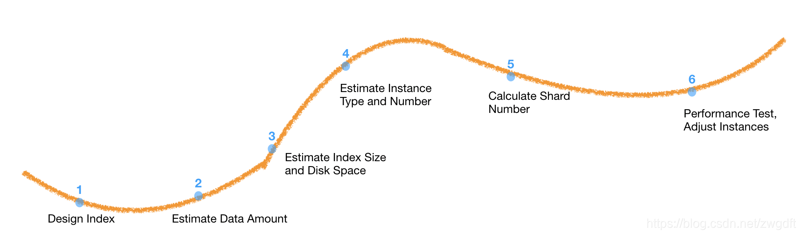

## 基于时间设计Index

##### 按照时间设计Index有以下2个优点：

1. 一旦**Index**创建后，<u>**Shard**的数量</u>就无法变更。虽然<u>**Shard**的数量</u>不可变，但是我们可以按照时间段来创建**Index**，如按小时创建、按天创建、按月创建，这样能将控制<u>**Shard**的数量</u>转换为控制<u>**Index**的数量</u>，来提高灵活性。
2. 同时，对某些应用来说，数据的搜索会集中在最近一段时间上，按时间切分，我们就可以只扫描近期的数据，从而减少不必要的扫描，<u>提升效率</u>。

当然并不是所有应用的**Index**都要按照时间来切分，比如数据增长缓慢的应用，就没必要按时间切分**Index**，切分后反而会减少分片中的数据量，使得降低得分的精度、降低查询速度。

##### 确定切分的时间间隔的依据：

1. 在按时间粒度切分时要保证分段的均匀，这对随时间变化均匀、能够预测的数据来说时容易做到的。
2. 而对于难以按时间预测的数据增长，**Elasticsearch**也提供了”Rollover and Shrink API“来按照体积自动合并、创建**Index**。

##### 实现Index的切分：

1. 基于时间设计**Index**，就要求我们能自动创建**Index**，而**Elasticsearch**提供了Index Template，简化了我们创建**Index**的工作。

## Mapping的设计技巧

**Mapping**设计的好，能够<u>节省空间</u>、<u>提升性能</u>。

而**Mapping**的设计主要考虑3个方面：

1. 尽量使用结构化的数据：虽然**Elasticsearch**支持半结构化的数据，但是前文也提到了，半结构化的数据水太深，开发者把握不住。
2. **Mapping**尽量扁平，因为**Elasticsearch**中不擅长`Join`等操作。
3. 对于需要精确匹配的字段，不应设置分词，即type=keyword。

[关于`Join`](https://juejin.cn/post/6844903807042715655)：

- `Nested`，嵌套文档：查询速度较慢，更新嵌套文档需要更新整篇文档。

- `Parent-Child`，父子文档：父、子文档可独立更新，而且需要额外的内存来维护关联关系。

  > 低版本中，借助于1个**Index**支持多个**Type**来实现的；高版本中，由于取消了多**Type**的设计，父、子文档必须为同一**Type**，而且需要是同一**Shard**，才能写入**Index**。

- 字段冗余：可采用宽表的方式实现`Join`。

此外，还要考虑一些常用参数：

1. `_all`

   1. `_all`是一个经过分析的字段，如果我们不清楚关键字在哪个字段中，可以开启这个`_all`字段，开启后**Elasticsearch**会结合所有字段建立一个新的**Index**，但是开启后会占用更多的磁盘，降低性能。
   2. `_all`常用于应用初期，之后随应用的发展，搜索需求会越来越精确，也就不再需要`_all`，此时会使用`include_in_all`的选项。
   3. `_all`也可以指定分析器。

2. `_source`

   1. 大部分场景都有搜索原文的需要，而“`_source`默认开启”也表明，[至少官方认为利大于弊](https://www.elastic.co/guide/cn/elasticsearch/guide/current/root-object.html#source-field)。

   2. 如果不开启，那么**Elasticsearch**只会保存Document.ID，能节省磁盘空间，但不会直接削弱查询速度。

      > 因为**Elasticsearch**的索引文件和数据文件是分开存放的，索引文件的大小、查询的速度，取决于建立索引的字段，而非磁盘中是否保存原文。
      >
      > `_source`在写入磁盘前会被压缩，会稍微影响读写速度。

3. `dynamic`

   动态映射，用于控制未定义字段的插入，可配置在根字段及其他字段上，且有3个值：

   1. strict，禁止插入，会报错，这个值常用，毕竟没人喜欢脏数据。
   2. true，允许插入未定义的字段。
   3. false，忽略未定义的字段。

4. `ignore_malformed`

   1. 可以用来忽略IP等类型的字段。

## 别名

借助别名，我们可以将按时间切分的索引重新聚合起来，同时，借助别名，我们可以实现将基于时间冷热数据分离。

## 分片分配原则

**Shard**的数量主要考虑3点：

1. 单片**Shard**的大小不宜超过30GB，过大的**Shard**会导致进行Relocate时，机器负载过高，进而影响系统的稳定性。
2. <u>**Shard**的数量</u>要基于”Data Node“的数量，以便负载均衡。
3. 小**Index**一般仅需1\~2片**Shard**；但如果其中是热点数据，可增加<u>**Shard**的数量</u>或<u>**Replica**的数量</u>，以便负载均衡。

[ElasticSearch推荐的最大JVM堆空间是](https://www.elastic.co/guide/en/elasticsearch/guide/current/relevance-intro.html)是 30\~32GB ，所以**Shard**的单片大小不宜超过30GB； 然后再对分片数量做合理估算，如，**Index**能达到200GB，则最多分配7~8片**Shard**。

另外，每个**Node**的<u>**Shard**的数量</u>[最好低于每GB配置](https://www.jianshu.com/p/297e13045605)20~25片（Why？），这时30GB的堆内存最多600\~750片**Shard**。

## 整体设计思路

完成上面的**Index**与**Shard**的设计，还需要以迭代的形式，不断预估、测试、调整，[其大体过程为](https://blog.csdn.net/zwgdft/article/details/86416668)：

## 应用

Elasticsearch的有[3种常见应用场景](https://blog.csdn.net/zwgdft/article/details/82917861)：

### 日志分析

使用**ELK**，即**Elasticsearch**、**Logstash**、**Kibana**的搭配来进行日志分析。

分布式系统中，日志也无可避免地散落在各个机器上，需要开发者这些日志进行集中：
1. **Logstash**负责从各台机器上收集日志，并写入到**Elasticsearch**中。
2. **Elasticsearch**负责检索，方便我们查看日志。
3. **Kibana**负责将**Elasticsearch**中的日志图形化为图表。

**Elasticsearch**是日志分析的核心，因为其强大的检索功能恰好满足日志检索的需要，而**Logstash**、**Kibana**都可以被替换为更好的工具。

### 聚合数据分析

所谓聚合数据分析指的是：
1. 先对数据按照条件过滤。
2. 然后将数据根据几个维度（字段）进行分组。
3. 最后统计数据（sum、count等聚合操作），也以供分析决策。

聚合数据分析也可以使用RDBMS来做，但是面对海量数据，RDBMS的单机性能有限，采用集群又会使应用变得复杂；而Elasticsearch基于集群，并且其强大的检索能力能够满足需要。

只是没有事物是完美的，**Elasticsearch**在“聚合数据分析”这种应用场景中存在2个问题：

1. 聚合结果可能存在偏差。
2. 数据需要规划好，保持扁平，不能有联表查询（`Join`）。

### 业务内搜索

用**Elasticsearch**对我们的业务数据进行搜索是很常见的应用场景。
1. 比如菜谱系统种，我们就可以使用**Elasticsearch**根据食材、烹饪方式、使用器材等条件进行快速检索。

**Elasticsearch**可以从多个维度进行搜索，并对每个搜索结果按Relevance（相关度）打分。

1. 我们可以直接根据Relevance对结果进行排序。
2. 也可以根据检索结果再去数据库中进行查询、过滤、排序。

在这一应用场景中，如何对排序结果进行调优是重点，有以下几个方向：

1. 如何建立业务内容的词库。
2. 如何合理分词，建立索引。
3. 如何调整搜索权重。

