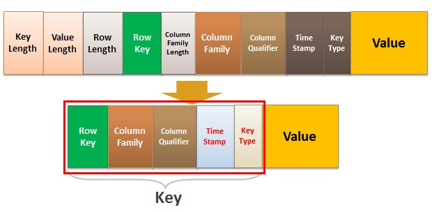

## 架构

如[上图](https://www.cnblogs.com/along21/p/10496468.html)所示，HBase的架构包括：

1. ##### Client

   1. 包含访问**HBase**的接口，并维护缓存以加速访问。
   2. **HBase** Client通过基于**Protocol Buffer**的RPC的方式与**HRegionServer**通信。

2. ##### Zookeeper

   1. 存储Schema、Table的元数据地址。

      > 真正的元数据还是保存在HBase上的一张以“hbase”作为命名空间的表“hbase:meta”上。

   2. 存储所有**HRegion**的寻址入口。

      > 无论读写，Client都是先向**Zookeeper**询问数据的**HRegion**入口，之后才会去访问**HRegion**。
      >
      > 每次吗？不会在本地缓存吗？RPC过程有点多啊。

   3. 确保在任意时刻，集群中只有一个**HMaster**。

      1. HMaster选举
      2. regionserver宕机了之后，zookeeper会通知hmaster，hmaster处理问题regionserver上遗留的hlog文件，根据region中的记录和hlog中的对应关系对hlog进行拆分（hlog文件是多个regionserver共享的），并把hlog放到相应的region目录下，region服务器领取到相应的region和hlog之后把hlog上的数据操作重新做一遍,,,然后memstore缓存,,刷新到storefile就可以了。https://zhuanlan.zhihu.com/p/145551967

   4. 监控**HRegionServer**的上下线，并通知**HMaster**。

3. ##### HMaster

   1. 为**HRegionServer**分配**HRegion**。
   2. 负责**HRegionServer**的负载均衡。
      1. 有多种策略
      2. 默认采用轮询方式。
   3. 发现失效**HRegionServer**，并重新分配其上的**HRegion**。
   4. 执行建表等DDL操作。

4. ##### HRegionServer

   1. 负责维护**HRegion**，处理**HRegion**上的IO。
   2. 负责切分运行过程中变得过大的**HRegion**。

5. ##### HRegion

   1. **HRegion**是**HBase**的中分布式存储和负载均衡的最小单位，但不是最终存储的最小单位。
      
      1. 每个**HRegion**都对应一张表，储存着一张表中的部分连续数据，

      2. 当其规模达到阈值时，**HReginServer**会自动将其等分为两个**HRegion**。
      
         > Region的拆分是有策略的。
         >
         > 还有就是，Rowkey递增会导致一直在start最大的机器上写。预分区、散列（加盐）来缓解这种热点问题，。
      
   2. **HRegion**分布在多个**HRegionServer**上。

   3. 一个**HRegionServer**管理着多个**HRegion**，而一个**HRegion**由一个**HLog**、多个**Store**组成。

   4. **HRegion**会保存所存储数据的起止行键，以便数据的定位查找。

6. ##### HLog（WAL，Write-Ahead Log）

   1. Hadoop Sequence File，简称HSF，一种存储键值对的文件。
   2. **HLog**本质上是一个HSF，其中
      1. 键的类型为HLogKey，保存有数据的归属信息，sequence id、write timestamp、cluster ids、region name、table name等信息。
      2. 值的类型为WALEdit，也是对增删改等操作的进一步封装，实质上是**HBase**的KeyValue对象。

7. ##### Store

   1. 一个**Store**由一个内存中的**MemStore**和多个硬盘上的**StoreFile**组成。
   2. 一个**Store**对应一个**Column Family**。这样的设计也从侧面反映出，**Column Family**的概念应对应数据库中的**Table**。

8. ##### MemStore

   1. **HBase**中的数据是先写入**HLog**，然后再写入**MemStore**，待**MemStore**中的数据达到阈值后，**HRegionServer**会将其flush到**StoreFile**中。
   2. 正是基于刷写的设计，Client查询时会先从**MemStore**中查找，未果后再从**StoreFile**中查找。

9. ##### StoreFile

   1. 当**StoreFile**的文件数量达到阈值后，HRegionServer会将其合并为更大的**StoreFile**：
      1. Minor Compaction，只合并漏了
      2. Major Compaction，将**Store**下的所有**StoreFile**合并成一个，合并时删除版本过期的数据，开销大，一般选择在空闲时间手动执行。

   2. 当一个**HRegion**的所有**SotreFile**的规模超过阈值时，所属的**HRegionServer**会将其分割为两个，并由**HMaster**分配到相应的**HRegionServer**上，实现负载均衡。

## 数据结构

RDBMS是以行进行存储了，一行中的字段（列）是固定的，无论该列有没有值，这也使得RDBMS不适合存储稀疏表。

**HBase**[按照列进行存储](https://zhuanlan.zhihu.com/p/145551967)，一条记录字段是不固定的，没有值的字段不存储，因此，**HBase**比RDBMS适合存储稀疏表。

> 稠密表大家都一样。

### 键值存储

**HBase**的实际存储单元是<u>键值对</u>，所谓的面向列，就是面向<u>键值对</u>，如[下图](https://blog.csdn.net/bitcarmanlee/article/details/78979836)所示：

1. Key：是由**Rowkey**、**Column Family**、列、版本、类型（增、删）等组成。
2. Value：就是我们实际保存的值。

> **Rowkey**的底层也是B+树。

### 行键

**Rowkey**的设计原则：

1. #### 唯一

   1. 最基本的要求。

2. #### 散列

   1. 散列的Key能保证负载的均衡，从而缓解热点问题。
   2. 可以通过Hash、时间戳反转的方式进行散列。
   3. 身份证号、车牌号自带散列特点。
   4. 加盐。

3. #### 简短

   1. 因为**HBase**面向<u>键值对</u>，**Rowkey**是占空间的，**Rowkey**越小越节省空间。
   2. 对于**Rowkey**中包含时间戳的数据，可以考虑按日期分表，这样**Rowkey**中仅需保存时间，节省空间。

4. #### 业务相关

   1. 以便查询。

**散列**与**业务相关**是矛盾的：

1. 写多于读的情景，越**散列**越好，负载能够均衡，同时再配合预分区，可以进一步提升性能。
2. 读多于写的情景，但**散列**的**Rowkey**而不利于数据的查询。

**HBase**按照**Rowkey**排序存放，所以**HBase**适合存储以实体为中心的数据。

1. 实体指的是自然人、车辆、账号、手机号等对象。

2. 以这些实体为中心的数据有：

   1. 基础属性信息（含标签类数据）。
   2. 关系信息（图数据）

   3. 事件数据：

      1. 监控数据
      2. 时序数据
      3. 位置数据
      4. 消息、日志数据
      5. 交易记录等

### 列族

**HBase**与RDBMS相比，除了支持高并发写和海量数据的随机、实时读外，还有个有优点是**Column Family**以及列的可扩展性上，而可扩展性，是由于采用了<u>键值对</u>的设计才获得的。

注意：

- **Column Family**一般[不多于两个](https://blog.csdn.net/diaoxie5099/article/details/101350743)，否则会因为Flushing和Compactions的相互作用导致大量不必要的IO，从而影响性能。

- **Column Family**之间的行数如果差异过大，比如A列族有百万条数据，而B列族有十亿条，会导致百万条数据会随十亿条数据的分散而分散，进而导致对A列族的大规模扫描变慢。

## 查询

### 查询方式

数据的查询方式：

1. `get`，通过**Rowkey**直接返回指定的记录。

2. `scan`，对表进行扫描。
   1. 使用`setCaching`、`setBatch`方法提高速度，空间换时间。
   2. 设置起止行：`start-key`、`end-key`。
   3. 使用`setFilter`设置过滤条件，但是会降低速度。

不难看出，**HBase**的[查询能力较弱](https://mp.weixin.qq.com/s/CXsGcbbsKTMXotlwRFQ5xw)，我们可以使用如下工具，针对具体场景来增强**HBase**的查询能力：

1. OpenTSDB，时序数据存储，提供基于Metrics、时间、标签等条件的组合查询。
2. GeoMesa，时空数据存储，提供基于时间、空间范围的索引能力。
3. JanusGrph，图数据存储，提供基于属性、关系的图索引能力。

但是即便有了这些工具的增强，**HBase**的查询能力也不能与RDBMS相比，当然**HBase**也不是旨在取代RDBMS，而是一种对其的补充。

#### HBase多条件查询

1. 将查询条件提前拼装到rowkey中
2. 过滤器，过滤器有：

