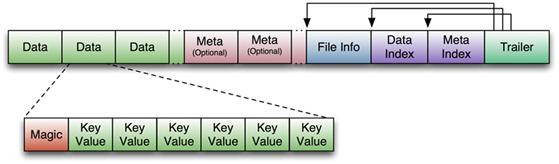
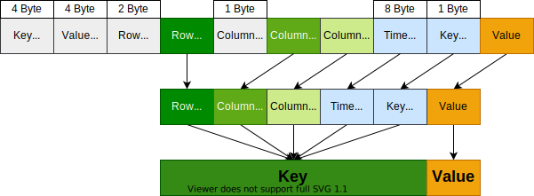
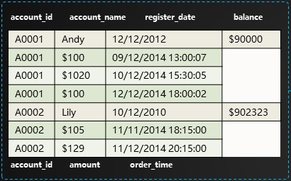
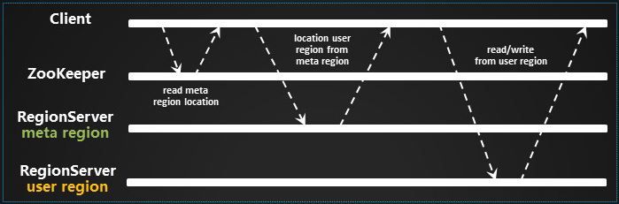
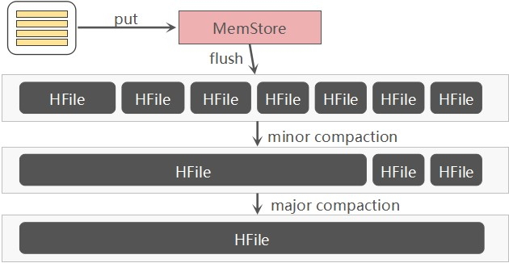

## 架构

如[上图](https://www.cnblogs.com/along21/p/10496468.html)所示，**HBase**的架构包括：

1. ##### Client

   1. 包含访问**HBase**的接口，并维护缓存以加速访问。
   2. **HBase** Client通过基于**Protocol Buffer**的RPC的方式与**Region Server**通信。

2. ##### Zookeeper

   1. 存储Schema、Table的元数据的地址。

      > 真正的元数据还是保存在**Region Server**上的，一张以“hbase”作为命名空间，的表——`hbase:meta`上。

   2. 存储所有**Region**的寻址入口、**Master**的地址。

   3. 确保在任意时刻，集群中只有一个**Master**。

      > 多个Master-eligible通过抢注的方式来竞选**Master**。

   5. 监控**Region Server**的上下线，并通知**Master**。

      > **Region Server**会在**Zookeeper**上注册临时节点；
      >
      > 当**Region Server**宕机后，相应的Session会超时，**Zookeeper**就会移除对应的临时节点，并通知**Master**；
      >
      > **Master**处理宕机的**Region Server**上遗留的**HLog**，根据**Region**中的记录和**HLog**中的对应关系对**HLog**进行拆分，并把**HLog**放到相应的**Region**目录下；
      >
      > **Region Server**领取到相应的**Region**和**HLog**后，会把**HLog**上的数据操作重新做一遍，然后将**MemStore**中的数据刷写到**StoreFile**上。[[1]](https://zhuanlan.zhihu.com/p/145551967#21/24)

3. ##### HMaster

   1. **Master**为**Region Server**分配**Region**。

      > 默认采用类似轮询的方式，来保证每个**Region Server**上的**Region**数量基本相同，以便负载的均衡。
      >
      > 对于热点聚集在某个**Region**上的问题无力解决，也不会由**Master**来解决。
      >
      > 此外，还有[一种叫做StochasticLoadBalancer的策略](http://openinx.github.io/2016/06/21/hbase-balance/#stochasticloadbalancer策略)，会根据多个因素计算加权成本。

   2. 发现失效**Region Server**，并重新分配其上的**Region**。

   3. 执行建表等DDL操作。

4. ##### HRegionServer

   1. 负责维护**Region**，处理**Region**上的IO。
   2. 负责切分运行过程中变得过大的**Region**。
   3. 一张表分为多个**Region**，分布在多个**Region Server**上；当然，一个**Region Server**管理着多个**Region**。

5. ##### HRegion

   1. **Region**是**HBase**的中分布式存储和负载均衡的最小单位，**Store**则是最终存储的最小单位。
   2. 每个**Region**都对应一张表，储存着一张表中的部分连续数据；每个**Region**会保存所存储数据的起止行键，以便数据的定位查找。

6. ##### HLog[[2]](https://segmentfault.com/a/1190000023394317)[[3]](https://www.jianshu.com/p/569106a3008f#14/27)

   1. 每个**Region Server**拥有一个或多个**HLog**，多个**Region**会共享一个**HLog**。

      > 默认只有1个，1.1版本可以开启MultiWAL功能，允许多个HLog。
      >
      > 共享**HLog**体现了<u>顺序写替换随机写</u>的思想。

   2. **HLog**会定时滚动，滚动时会新建一个新**HLog**来接收新的日志，滚动的目的是为了防止单个**HLog**体积过大。

   3. 已落盘到**StoreFile**中的日志会被清理，清理过程以**HLog**文件为单位进行。

   4. **HLog**是一种WAL，Write-Ahead Log，其本质上是一个**HSF**，而**HSF**（Hadoop Sequence File）是一种存储<u>键值对</u>的文件：

      1. Key为HLogKey：保存有数据的归属信息，`sequence id`、write timestamp、cluster ids、region name、table name等信息。
      2. Value为WALEdit：也是对增删改等操作的进一步封装，实质上是**HBase**的<u>键值对</u>对象。

      > 事务、Failover、HLog的清理[都是根据](http://hbasefly.com/2017/07/02/hbase-sequenceid/)`sequence id`来进行的。

   5. **HLog**有3种Failover方式：

      1. **Master**单打独斗。
      2. **Master**发布任务，**Region Server**抢占任务。
      3. 方式2产生很多小文件，所以方式3采用先重新分配**Region**，然后将**HLog**重放，而非直接写入**HDFS**。
      
      > 但方式3在Rolling Upgrade时会[不可靠](http://hbasefly.com/2016/10/29/hbase-regionserver-recovering/#7/11)，已在1.2.0版本[移除](https://www.docs4dev.com/docs/zh/apache-hbase/2.1/reference/book.html#upgrade2.0.distributed.log.replay)。
      >
      > Rolling Upgrade是指：在高可用环境中一个节点先安装补丁或升级版本，其他节点正常提供服务，待节点安装或升级完成后，下一个节点再安装或升级。

7. ##### HStore

   1. 一个**Region**包含多个**Store**，一个**Store**[对应一个](https://blog.csdn.net/zhouleilei/article/details/8500938)**Column Family**。

      > 这样的设计也从侧面反映出，**Column Family**的概念应对应数据库中的**Table**。

   2. 一个**Store**由一个内存中的**MemStore**和多个硬盘上的**StoreFile**组成。

8. ##### MemStore

   1. **HBase**中的数据是先写入**HLog**，然后再写入**MemStore**，待内存占用达到阈值[或](https://www.iteblog.com/archives/2497.html#_MemStore_Flush)单个**MemStore**达到阈值后，**Region Server**会将其`flush()`到**StoreFile**中。

   2. **MemStore**采用跳表来组织数据。

      > 对于IO密集的场景，瓶颈不在内存，而在硬盘。增大JVM的内存，反而会影响**GC**，导致IO下降，不如增加一台机器，分摊IO压力。[[4]](http://hbasefly.com/2016/12/21/hbase-getorscan/#10/27)

9. ##### StoreFile

   1. **StoreFile**会根据一定条件进行Compaction，具体内容见下文。

   2. **StoreFile**是对**HFile**的简单封装。

      > HFile，Hadoop Binary File。

## 数据结构

RDBMS是以行进行存储了，一行中的字段（列）是固定的，无论该列有没有值，这也使得RDBMS不适合存储稀疏表。

**HBase**[按照列进行存储](https://zhuanlan.zhihu.com/p/145551967)，一条记录字段是不固定的，没有值的字段不存储，因此，**HBase**比RDBMS适合存储稀疏表。

> 稠密表大家都一样。

### HFile

如[下图](https://www.iteye.com/blog/asyty-1250301)所示，**HBase**对**HFile**[做了如下封装](https://blog.csdn.net/u011490320/article/details/50814967#3.4/8)：

- **Data Block**：保存数据，可被压缩。
- **Meta Block**：保存用户自定义的<u>键值对</u>，可被压缩，可选。
- **File Info** ：**HFile**的元信息，定长。
- **Data Block Index** ：对**Data Block**的索引，索引项为每个**Data Block**的起始点。
- **Meta Block Index**：对**Meta Block**的索引，索引项为每个**Meta Block**的起始点，可选。
- **Trailer**：保存了每一段的偏移量，或者说时其他数据块的起始位置， 定长。

#### 对数据块的补充

**Data Block**的大小可在建表时通过参数指定，大的Block有利于顺序`scan`，小的Block利于随机查询。

**Data Block**的开头为Magic，由随机数字组成，用于防止数据损坏；Magic后面紧接着一个个<u>键值对</u>。

#### 查询过程

查询数据时，会根据Key从[**Block Cache**](https://www.cnblogs.com/zackstang/p/10061379.html)中寻找。

若未果，则去对应的**HFile**中寻找，线读取其**Trailer**来定位**Data Block Index**，然后将**Data Block Index**读入内存，这样在检索时，便可以在内存中直接根据Key定位**Data Block**的偏移量，然后将整个**Data Block**读入内存，再通过遍历找到需要的<u>键值对</u>。

> **MemStore**主要用于写，**Block Cache**用于读。
>
> **Block Cache**基于**LRU**。
>
> **Block Cache**不是万能的，对于不会再次读取或很少再次读取的数据，如，随机读、全表扫描等场景，放入缓存只会打乱内存分布，触发过多没必要的**GC**，这时可以开启**Bucket Cache**。
>
> 开启堆外（Off Heap）的**Bucket Cache**后，**HBase**会将所有的**Data Block**放入**Bucket Cache**中；而`hbase:meta`、索引、Bloom Filter等元数据，仍然保存在堆内（On Heap）的**Block Cache**中。
>
> **Bucket Cache**的速度接近**Block Cache**，但延迟稳定，无需GC。

### 键值存储

**HBase**的实际存储单元是<u>键值对</u>，所谓的面向列，就是面向<u>键值对</u>，**HFile**中的<u>键值对</u>结构如[下图](https://blog.csdn.net/bitcarmanlee/article/details/78979836)所示：

1. Key：是由**Rowkey**、**Column Family**、列、版本、类型（增、删）等组成。
2. Value：就是我们实际保存的值。

> **Rowkey**的底层也是B+树。

### 行键

**Rowkey**的设计原则：

1. #### 唯一

   1. 最基本的要求。

3. #### 简短

   1. 因为**HBase**面向<u>键值对</u>，**Rowkey**是占空间的，**Rowkey**越小越节省空间。
   2. 对于**Rowkey**中包含时间戳的数据，可以考虑按日期分表，这样**Rowkey**中仅需保存时间，节省空间。

4. #### 散列

   1. 散列的Key能保证负载的均衡。
   2. 可以通过Hash（MD5、SHA-1）、反转（ID、手机号）、前缀加盐的方式进行散列。

   > 身份证号、车牌号自带散列特点。
   >
   > 前缀加盐是比较好的散列方式，令**Rowkey**仍然业务相关，但是会增**Rowkey**的长度，增加文件体积。
   >
   > 最好不要采用时间、ID等明显有分段现象的属性直接当作**Rowkey**来使用，可以反转后再使用。

另外，**Rowkey**应该是业务相关，以便查询，但**业务相关**与**散列**是矛盾的，所以：

1. <u>写多于读</u>的情景，尽量**散列**，负载能够均衡，同时再配合预分区，可以有效缓解热点问题。
2. <u>读多于写</u>的情景，应避免**散列**，以便根据业务属性直接组装**Rowkey**，从而快速查出数据。

**Rowkey**按照字典序排列，类似于联合索引，重要的信息应往前放。

> 技巧：**Rowkey**确实按照字典序排列，但将时间差`Long.MAX_VALUE – timestamp`拼入**Rowkey**并不能使其散列，倒序不是反转，但倒序可用来实现返回最近N条记录。使用`scan.setReversed(true)`倒序扫描也可实现返回最近N条记录。

> **HBase**适合存储以实体为中心的数据。
>
> 1. 实体指的是自然人、车辆、账号、手机号等对象。
> 2. 以这些实体为中心的数据有：
>    1. 基础属性信息（含标签类数据）。
>    2. 关系信息（图数据）
>    3. 事件数据。
>
> 其中，事件数据又分为：
>
> 1. 监控数据。
>
> 2. 时序数据。
>
> 3. 位置数据。
>
> 4. 消息、日志数据。
>
> 5. 交易记录。一个技巧，用一张表存储账户和交易两类数据，如[下图](http://www.nosqlnotes.com/technotes/hbase/hbase-rowkey/#27.5/41)所示：
>
>    

### 列族

**HBase**与RDBMS相比，除了支持高并发写和海量数据的随机、实时读外，还有个有优点是无模式的。无模式是因为基于<u>键值对</u>，所以“<u>字段</u>”可以自由扩展。

**HBase**没有`JOIN`，**Column Faimly**、无模式的设计一定程度上起到了`JOIN`的作用。

**Column Faimly**虽然也能扩展，即，一张表支持多个**Column Faimly**，但是，**Column Family**[不要多于两个](https://blog.csdn.net/diaoxie5099/article/details/101350743)，因为不同的**Column Family**的数据量往往差异很大（不均匀），比如A列族有十万条数据，而B列族有十亿条，那么：

- 在1.2.0之前，A列族会随B列族进行Flushing、Compactions，B列族也会随A列族进行，这种相互作用导致大量不必要的IO，从而影响性能。
- 同时还会导致十万条数据会随十亿条数据的分散而分散，即A列族分散在多个文件中，进而导致对A列族的大规模扫描变慢。

而且，**Sotre**是以**Column Family**为单位的，越多的**Column Family**就会有越多的**MemStore**，消耗更多的内存，`flush`也会更吃力。

但如果，同一张表的不同**Column Faimly**的数据量差距不大，或者仅有的一个**Column Faimly**可以切分为多个数据量相差不大**Column Faimly**，那么，多**Column Faimly**的设计，允许程序按需查询数据，而非只能直接返回全部字段，[这样能节省IO、内存空间](https://www.cnblogs.com/duanxz/p/4660784.html#8/12)。

> 比如，轨迹记录可以分为`entity`、`action`、`site`三个**Column Faimly**：
>
> - `entity`保存身份证号、姓名、性别、车牌号、号牌种类等实体信息，
> - `action`保存发生时间、行为类型、行为标签、地点名称等行为信息，
> - `site`保存经纬度、地点编号、地点标签等点位信息。
>
> 如果无需在地图上绘制，就不需要查询`site`，从而节省IO。
>
> 但是，很难保证不同**Column Faimly**的数据量差距不大，因为即便**Column Faimly**的字段数量相同，但不同字段的长度往往不同。

### 更多

更多关于**HBase**的调优、设计可参照[文章](https://www.cnblogs.com/duanxz/p/3154345.html)。

## 读写

### 读写过程[[5]](https://blog.csdn.net/wonderful_life_mrchi/article/details/77566803#数据读写流程)

如[上图](http://www.nosqlnotes.com/technotes/hbase/hbase-rowkey/#9/41)所示：

1. Client访问**Zookeeper**，获取`hbase:meta`所在的**Region**和**Region Server**地址。
2. Client到相应的**Region Server**中读取`hbase:meta`表，并根据Namespace、Table Name、**RowKey**获取**Region**以及**Region Server**地址。
4. Client向**Region Server**直接请求，进行数据读写。

可以看到，**HBase**的RPC过程有点多，[所以](https://chenhy.com/post/hbase-quickstart/#1-4-数据路由-hbase-meta)：

- Client从**Zookeeper**获取到`hbase:meta`所在的**Region Server**的地址后，会缓存该地址，以减少对**ZooKeeper**的访问。
- Client从`hbase:meta`中获取到**RowKey**对应的**Region Server**的地址后，会缓存该地址，以减少对`hbase:meta`的访问。

> - 0.96 版本以前会多一步，这是因为**HBase**在设计之初担心`hbase:meta`会太大。
> - Client对`hbase:meta`的缓存不更新，如果`hbase:meta`的内容发生了变化，如**Region**放到了别的**Region Server**上，Client根据缓存去访问时就会报错，报错后会进行有限重试，所有重试失败后，就会去`hbase:meta`所在的**Region Server**获取最新的数据，如果`hbase:meta`不在之前的**Region Server**上，则会去**Zookeeper**上重新获取`hbase:meta`所在的**Region Server**的地址。
> - 以上两点补充来自[一篇超详细的HBase学习笔记](https://www.jianshu.com/p/569106a3008f#10/27)。

### 查询方式

数据的查询方式：

1. `get`，通过**Rowkey**直接返回指定的记录。

2. `scan`，对表进行扫描。
   1. 使用`setCaching`、`setBatch`方法提高速度，空间换时间。
   2. 设置起止行：`start-key`、`end-key`。
   3. 使用`setFilter()`设置过滤器，但是会降低速度。

### 多条件查询

使用`setFilter()`设置[单个过滤器或一组过滤器](https://juejin.cn/post/6844903949732937736)。

可将查询条件提前拼装到**Rowkey**中，对**Rowkey**施以相应过滤。

#### 比较过滤器

- **CompareFilter**支持`<`、`<=`、`=`、`!=`、`>=`、`>`、`exclude`等各类运算符。

- **CompareFilter**支持`Binary`、`Binary Prefix`、`Regex String`、`Sub String`、`Null`、`Bit`等比较器。

- **CompareFilter**分为`RowFilter`、`FamilyFilter`、`QualifierFilter`、`ValueFilter`、`DependentColumnFilter`等过滤器。

#### 专用过滤器

- **SingleColumnValueFilter**：过滤单列列值。

- **SingleColumnValueExcludeFilter**：排除单列列值。

- **PrefixFilter**：过滤行键前缀。
- **ColumnPrefixFilter**：过滤列名前缀。
- **PageFilter**：分页。
- **TimestampsFilter**：过滤时间戳。
- **FirstKeyOnlyFilter**：过滤首次行键。扫描完第一列，就跳转到下一行，适合统计行数。

#### 包装过滤器

- **SkipFilter**：包装一个过滤器，当被包装的过滤器遇到一个需要过滤的<u>键值对</u>时，则拓展过滤整行数据。
- **WhileMatchFilter**：包装一个过滤器，当被包装的过滤器遇到一个需要过滤的<u>键值对</u>时，结束本次扫描，返回已经扫描到的结果。

### 二级索引

#### Coprocessor

在`Put`数据时，向**HBase**中的二级索引表插入索引向。

> **Apache Phoenix**功能围绕SQL On HBase，提供二级索引。

或者[直接改造Coprocessor](https://blog.csdn.net/bluishglc/article/details/31799255)。

#### ElasticSearch、Solr

在**ElasticSearch**、**Solr**等数据库建立对**HBase**表的二级索引。

#### 增强

不难看出，**HBase**的[查询能力较弱](http://www.nosqlnotes.com/technotes/hbase/hbase-overview-concepts/)，我们可以使用如下工具，针对具体场景来增强**HBase**的查询能力：

1. OpenTSDB，时序数据存储，提供基于Metrics、时间、标签等条件的组合查询。
2. GeoMesa，时空数据存储，提供基于时间、空间范围的索引能力。
3. JanusGrph，图数据存储，提供基于属性、关系的图索引能力。

但是即便有了这些工具的增强，**HBase**的查询能力也不能与RDBMS相比，当然**HBase**也不是旨在取代RDBMS，而是一种对其的补充。

## 刷写、合并、拆分

### 刷写

1.2.0以前，`flush()`的单位是**Region**，而非单个**MemStore**；1.2.0之后，`flush()`[的粒度细化到](http://hbasefly.com/2017/07/02/hbase-sequenceid/#5.1/12)**MemStore**。

`flush()`时，**Region**会不可用：**Region Server**会对**Region**做Snapshot，对**HLog**进行Checkpoint。

由于采用了刷写的设计，Client查询时会先从**MemStore**中查找，未果后再从**StoreFile**中查找。

[刷写时机](https://cloud.tencent.com/developer/article/1005744)有6种：

1. **MemStore**级别限制：当**Region**中任意一个**MemStore**的大小达到阈值，就会触发`flush()`。
2. **Region**级别限制：当**Region**中所有**MemStore**的大小总和达到了阈值，就会触发`flush()`。
3. **Region Server**级别限制：当一个**Region Server**中所有**MemStore**的大小总和达到了阈值，就会触发`flush()`，将最大的几个**MemStore**刷写，直至所有**MemStore**的大小总和低于另一个阈值。
4. 当**Region Server**中**HLog**数量达到上限时：会选取最早的一个**HLog**对应的一个或多个**Region**进行`flush`。
5. 定期`flush`：默认周期为1小时。为避免所有的**MemStore**同时`flush`，定期`flush`会有20000左右的随机延时。
6. 手动`flush`：用户通过shell命令对表或**Region**进行`flush`。

阈值检查的时机分为3种：

1. 写操作前会检查阈值。
2. 合并、拆分**Region**前会检查阈值。
3. 定时。

### 合并StoreFile[[6]](http://hbasefly.com/2016/07/13/hbase-compaction-1/)

当满足某些条件时，**Region Server**会将**SotreFile**合并为更大的**StoreFile**：

1. Minor Compaction：每次`flush()`前，会检查**StoreFile**的文件数量是否达到阈值，若是，则选取部分相邻的**StoreFile**进行合并。会频繁进行。
2. Major Compaction：对整个**Region**中相同**Column Family**的所有**Store**合并成一个，合并时会清理被标记删除的、TTL到期、版本号超过设定版本数的数据，开销大。默认每周自动触发一次；但往往禁用自动触发，选择在空闲时间手动执行。

Compaction相关参数可查看[文章](https://blog.csdn.net/shenshouniu/article/details/83902291)。

### 拆分Region

当满足[拆分策略](https://www.cnblogs.com/duanxz/p/3154487.html)所规定的条件时，**Region Server**就会自动将**Region**拆分为均等的两份。

拆分**Region**前，**Region Server**会先将**Region**下线；拆分完成后，**Region Server**在`hbase:meta`新增**Daughter Region**的信息，即，将**Daughter Region**上线，向**Master**汇报，**Master**会将**Daughter Region**分配到相应的**Region Server**上，实现负载均衡。

[拆分过程会在秒级以内，因为](https://www.cnblogs.com/duanxz/p/4516283.html#11/12)只是对**Parent Region**进行了逻辑拆分，没有底层数据的重组，即，**Parent Region**没有被销毁，**Daughter Region**只是简单的对**Parent Region**进行了索引。只有当**Daughter Region**进行Major Compaction后，发现不再被**Daughter Region**索引后，才会将其进行清理。

可以看到，拆分会导致**Region**暂时不可用，所以往往会关闭自动拆分，并且在建表时，对**Region**进行预分区。

> 关闭方式为：将`hbase.hregion.max.filesize`设为足够大，并指定拆分策略为**ConstantSizeRegionSplitPolicy**。

### 拆分策略

- ##### ConstantSizeRegionSplitPolicy

  - 0.94 版本之前的默认策略，当一个**Region**的所有**SotreFile**的大小之和达到阈值时就会对其进行拆分。

- ##### IncreasingToUpperBoundRegionSplitPolicy

  - 0.94 版本之后的默认策略，根据`min(r^2 * flushSize, maxFileSize)`确定**Region**的体积阈值。
  - 其中`r`为**Region**的数量。
  - `flushSize`由`hbase.hregion.memstore.flush.size`确定，默认134217728（128 MB）。
  - `maxFileSize`由`hbase.hregion.max.filesize`确定，默认10GB。

- ##### DelimitedKeyPrefixRegionSplitPolicy

  - 以**Rowkey**的前缀为拆分依据，保证相同**RowKey**前缀的数据在同一个**Region**中。
  - 通过分隔符来间隔前缀和后缀。

- ##### KeyPrefixRegionSplitPolicy

  - 以**Rowkey**的前缀为拆分依据，保证相同**RowKey**前缀的数据在同一个**Region**中。
  - 通过**Table**的`prefix_split_key_policy.prefix_length`属性，来指定前缀长度。
  - 该策略适合前缀固定的**Rowkey**。
  - 当Table未设置该属性，或该属性不为**Integer**类型时，还是会使用**IncreasingToUpperBoundRegionSplitPolicy**。

> 按前缀拆分的两种策略较少使用。
>
> 技巧：“|”的[ASCII值](https://zh.wikipedia.org/wiki/ASCII#.E5.8F.AF.E6.98.BE.E7.A4.BA.E5.AD.97.E7.AC.A6)为124，“~”的ASCII值为126，大于所有的数字和字母等符号。

